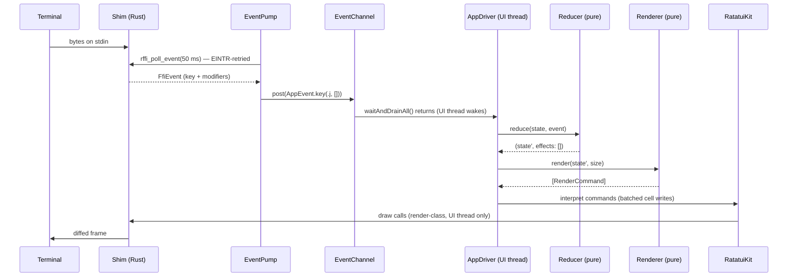
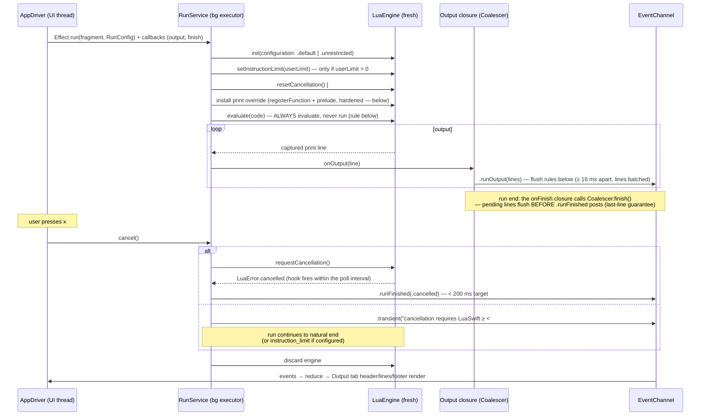
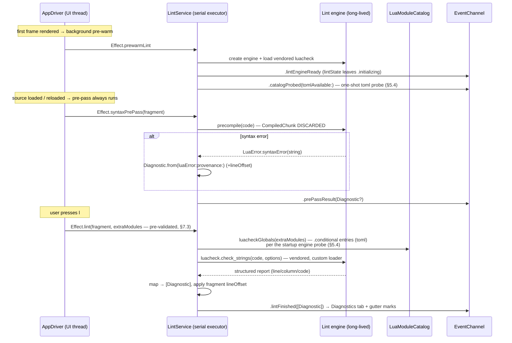
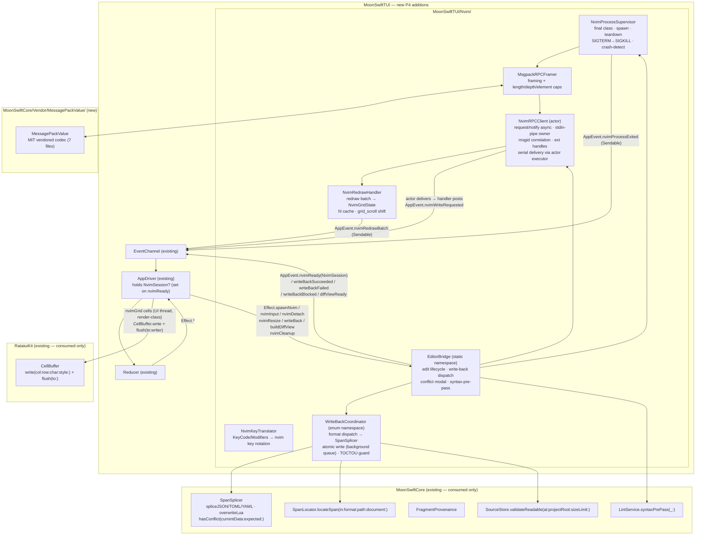
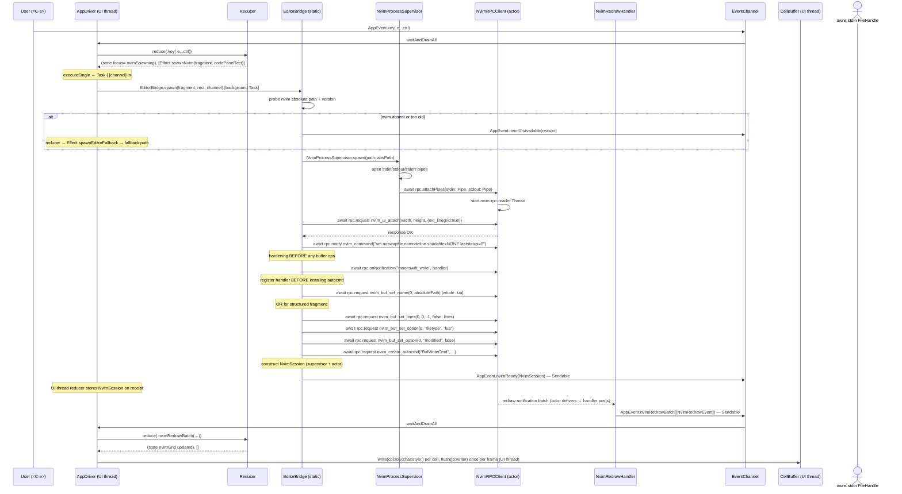
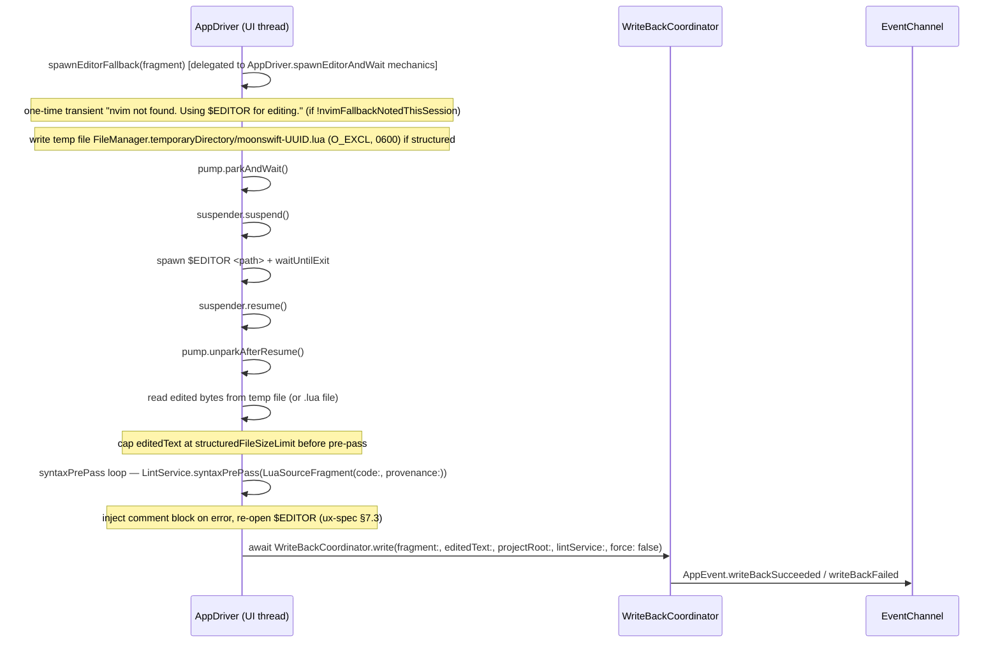

# MoonSwift — Architecture

Status: v1 round 4 (architecture phase, 2026-06-07 — round-3 audit fixes
applied; see tmp/arch-workspace/round4-response.md)
Upstream sources of truth: `REQUIREMENTS.md` (final, 2026-06-07) and the PRD
`.taskmaster/docs/20260607-1156_moonswift_v1_PRD_full-roadmap.txt` (round-2
converged; corrected again in the same change-set as this revision — see
§5.3 and §4.3).
This document deepens PRD §4 (components, threading, FFI contracts, repo
layout); where the PRD is normative (e.g. the `moonswift.toml` schema, §4.2)
this document references it and never restates or contradicts it. Decisions
made *here* beyond the PRD are marked **[ARCH]**.

---

## 1. Overview

MoonSwift is a macOS-only terminal (TUI) workbench for developing and testing
Lua scripts written against the LuaSwift library: load `.lua` files and
Lua-bearing string fields inside JSON/YAML/TOML files, run them in a real
LuaSwift engine, lint them with LuaSwift-aware globals, and (in later phases)
mock the host app's sharing area, debug, complete, and edit with write-back.

The architecture is three concentric layers around a single unidirectional
state loop. The pattern, stated plainly first: *all* application state lives
in one value, every change to it is an event, one pure function consumes
(state, event) and returns the next state, and one pure function turns state
into a frame. Nothing else mutates anything. This is the Elm architecture,
and the layers are:

1. **Elm-style TUI core** (`MoonSwiftTUI`): one `AppState` value (a
   `Sendable` struct; the reducer returns a fresh copy — no in-place
   mutation), one `AppEvent` stream, one pure reducer, one pure renderer.
   Every mutation — keypress, run output line, lint result, resize — enters
   as an event on one channel drained by one UI thread. The **AppDriver**
   (§5.1) is the single impure component that owns this loop: it drains the
   channel, calls the reducer, executes the effects the reducer returns, and
   triggers renders. There is no other writer.
2. **Service layer** (`MoonSwiftCore`): terminal-free domain logic — project
   file, source loading with provenance, JSONPath subset, run, lint, catalog.
   Services execute on background executors and communicate with the loop
   *exclusively* through `@Sendable` callbacks handed to them by the
   AppDriver — they never see the channel or any TUI type. `MoonSwiftCore`
   has **zero terminal I/O** and is fully unit-testable (PRD coverage gate:
   ≥ 85%).
3. **FFI shim** (`RatatuiKit` → `CRatatuiFFI` → vendored Rust
   `ratatui-ffi` fork): terminal ownership, input decoding, widgets, and
   cell-level drawing live in Rust (ratatui + crossterm) behind a small,
   panic-guarded C ABI. Only `RatatuiKit` touches the FFI.

Why this shape:

- **Testability.** A pure `(AppState, AppEvent) → AppState` reducer and a
  pure `(AppState, Size) → render commands` renderer make every key flow a
  table-driven test and every screen a cell-buffer snapshot test — no
  terminal, no FFI in the test process (PRD §10 layers 1/3).
- **Swift 6 strict concurrency.** A single-writer state confined to one UI
  thread plus `Sendable` events is the simplest model that compiles clean
  under `StrictConcurrency` while keeping engines (which are not
  thread-safe) confined to their own executors.
- **Leverage over reinvention.** ratatui is a mature widget/terminal stack;
  the Rust→C-ABI→Swift shim buys it for the cost of a restructured, pinned
  fork instead of a hand-rolled Swift terminal layer (decision table, §6).
  The pattern is proven: **mmdr** and **mermaid-ffi** are two prior internal
  libraries by the same author that ship Rust engines to Swift through this
  exact `ffi_guard` + error-protocol shape.

---

## 2. Component Map

```mermaid
flowchart TB
    subgraph exe["moonswift (executable)"]
        CLI["Main / CLI<br/>arg parse · exit codes"]
    end

    subgraph tui["MoonSwiftTUI"]
        PUMP["EventPump<br/>(pump thread, poll-with-timeout)"]
        CHAN["EventChannel<br/>(thread-safe MPSC queue)"]
        DRV["AppDriver<br/>(UI thread: drain → reduce →<br/>effects → render)<br/>holds NvimSession? (set on nvimReady)"]
        TICK["Tick source<br/>(AppDriver-owned thread)"]
        RED["Reducer + AppState<br/>(pure)"]
        REN["Renderer<br/>(pure: state → commands)"]
        HL["Highlighter<br/>(span cache; effect-driven parse)"]
        THEME["ThemeEngine"]
        subgraph nvim["MoonSwiftTUI/Nvim/ (P4 F8b)"]
            EB["EditorBridge<br/>(static namespace)<br/>edit lifecycle · conflict modal"]
            WB["WriteBackCoordinator<br/>(static async enum)<br/>format dispatch → SpanSplicer<br/>atomic write · TOCTOU guard"]
            NPS["NvimProcessSupervisor<br/>spawn · teardown · SIGTERM→SIGKILL"]
            RPC["NvimRPCClient (actor)<br/>request/notify · stdin-pipe owner<br/>onNotification registry"]
            RDH["NvimRedrawHandler<br/>redraw batch → NvimGridState<br/>hl cache · grid_scroll shift"]
            KT["NvimKeyTranslator<br/>KeyCode/Modifiers → nvim notation"]
            MP["MessagePackValue (vendored)<br/>MoonSwiftCore/Vendor/ · MIT · 7 files"]
        end
    end

    subgraph core["MoonSwiftCore (no terminal I/O)"]
        PS["ProjectStore<br/>(ProjectFile codec + validation)"]
        SS["SourceStore<br/>(fragments + provenance)"]
        SPC["SpanSplicer<br/>spliceJSON/TOML/YAML · overwriteLua<br/>hasConflict(currentData:expected:)"]
        SL["SpanLocator<br/>locateSpan(in:format:path:document:)"]
        JP["JSONPathSubset"]
        RS["RunService"]
        LS["LintService"]
        CAT["LuaModuleCatalog +<br/>CatalogGenerator"]
        LED["LuaErrorDiagnostics<br/>(helper seam)"]
        ELP["LuaErrorLineParser<br/>(deleted in P2)"]
        LOG["Logger"]
    end

    subgraph ffi["FFI overlay"]
        RK["RatatuiKit<br/>(safe Swift wrappers,<br/>two API groups + thread asserts)<br/>CellBuffer: write(col:row:char:style:)<br/>+ flush(to:) = nvim-grid blit API<br/>(UI-thread-only, render-class §5.2)"]
        CF["CRatatuiFFI<br/>(C module: header + lib)"]
        RUST["rust/ratatui-ffi<br/>(vendored fork: ffi_guard,<br/>events, widgets, cell API)"]
    end

    subgraph engines["LuaSwift engines"]
        RE["Run engine<br/>(fresh per run)"]
        LE["Lint engine<br/>(long-lived, luacheck)"]
    end

    CLI --> DRV
    PUMP --> CHAN
    TICK --> CHAN
    CHAN --> DRV
    DRV --> RED
    DRV --> REN
    DRV --> TICK
    REN -- "render-class<br/>(UI thread)" --> RK
    PUMP -- "input-class<br/>(pump thread)" --> RK
    RK --> CF --> RUST
    DRV -. "effects → service calls<br/>+ domain callbacks" .-> RS & LS & PS & SS & HL
    RS & LS & SS & PS -. "callback wraps payload,<br/>posts AppEvent" .-> CHAN
    HL -. ".highlightReady(SourceID, spans)<br/>payload → reducer → AppState" .-> CHAN
    SS --> JP
    LS --> CAT
    RS --> RE
    LS --> LE
    RS & LS --> LED
    LED --> ELP
    REN --> THEME
    DRV -- "Effect.spawnNvim/nvimInput/writeBack/…" --> EB
    EB --> NPS
    EB --> RPC
    EB --> WB
    RPC <--> MP
    RPC --> RDH
    RDH -- "AppEvent.nvimRedrawBatch" --> CHAN
    NPS -- "AppEvent.nvimProcessExited" --> CHAN
    EB -- "AppEvent.nvimReady / writeBackSucceeded\n/ conflictDetected / diffViewReady" --> CHAN
    WB --> SPC
    WB --> SL
    DRV -- "nvimGrid cells (UI thread, render-class)\nCellBuffer.write + flush(to:writer)" --> RK
```



`RatatuiKit` exposes exactly **two API groups** matching the edge labels
above — *input-class* (called only from the pump thread) and
*render/terminal-class* (called only from the UI thread) — and asserts the
calling thread in debug builds (§5.2).

Dependency rule (binding, from PRD §4.1): `moonswift → MoonSwiftTUI →
MoonSwiftCore`; `MoonSwiftTUI → RatatuiKit → CRatatuiFFI`. `MoonSwiftCore`
never imports `MoonSwiftTUI` or `RatatuiKit`. Only `RatatuiKit` contains FFI
calls.

| Component | Responsibility | Boundary | Must NOT |
|---|---|---|---|
| **Main / CLI** | Parse args (`--version`, `--help`, path), resolve launch mode (project dir / single `.lua` / empty state), install crash-restore handlers (guarded no-ops until terminal init, §3f), load the project file via ProjectStore, terminal init, construct + start the AppDriver (seed state = decoded ProjectFile only), map termination to sysexits codes (PRD §4.7) | Owns process entry/exit only | Contain domain or UI logic; render anything itself; call SourceStore (source loading is the loop's `.loadSources` effect, §3a) |
| **AppDriver** | Owns the loop: `waitAndDrainAll` the EventChannel, call `reduce` per event, execute returned `[Effect]` by dispatching to services, construct every service callback (incl. the coalescing output closure, §3c), apply `.highlightReady` span payloads to the state-held span store (§3b note in Highlighter row), arm/disarm the tick source on `.startTick`/`.stopTick`, render after each drain batch (approximately every 32 ms during long batches — flood guard, §3b), execute `.quit(exitCode:)` by setting the loop-exit flag (the loop breaks before reducing further events, tears down, then exits — §5.1; never a direct `exit()` inside effect execution) | The **only** entity that calls both `reduce` and services; lives on the UI thread | Contain domain logic; be called by services (services only ever invoke the closures handed to them) |
| **EventPump** | Poll the shim's C event stream with a timeout (~50 ms loop) on a dedicated thread; decode `FfiEvent` → `AppEvent`; retry the poll on `EINTR`; forward into EventChannel; park on a condition variable when the `$EDITOR` suspension flag is set (§5.2) | Sole caller of *input-class* shim functions (§5.2); implements the `EventSource` protocol so tests inject a scripted source (no FFI link in `MoonSwiftTUITests`) | Touch `AppState`; call render/terminal-class shim functions |
| **EventChannel** | Thread-safe MPSC queue (condition-variable blocking pop) carrying `AppEvent` from pump + tick + service callbacks to the UI thread | The only cross-thread conduit into the loop; contract in §5.1 (`waitAndDrainAll`) | Reorder events from a single producer; drop events |
| **Tick source** | AppDriver-owned thread posting `.tick` at the armed interval; armed/disarmed by the AppDriver inspecting reducer-returned `.startTick(interval:)` / `.stopTick` effects. `.startTick` **always replaces** the current interval: the reducer computes **one** interval — the minimum required by currently-active consumers (run-coalescer tick **100 ms** while `runState == .running`; highlight pulse 500 ms; transient expiry 1.5 s) — re-emits `.startTick` on any change, and emits `.stopTick` when no consumer is active (§3b) | Runs only while an animation/transient is active **or a run is in progress** (each `.tick` triggers a coalescer flush-if-pending, §3c) — the loop is otherwise fully idle **[ARCH]** | Run unarmed; be touched by anything but the AppDriver |
| **Reducer + AppState** | `(AppState, AppEvent) → (AppState, [Effect])`; all state transitions, key dispatch (binding pattern: **dispatch tables** — key → action maps per focus context, never long `switch` chains), focus model | Pure value-semantics function on the UI thread | Perform I/O, touch engines, call the FFI, block, call `exit` (quitting is `Effect.quit`) |
| **Renderer** | Pure `(AppState, Size) → [RenderCommand]`; layout math, widget population, cell-level code-pane drawing (gutter, highlight spans, marks); reads the span store **in `AppState`** only — never parses, never touches the Highlighter | Emits commands interpreted by RatatuiKit; snapshot-tested against an in-memory `CellGrid` | Mutate state; call the FFI directly; read files; trigger parsing; read any non-UI-thread-owned data |
| **Highlighter** | Runs tree-sitter parses as an **effect** off the UI thread on source-change events; owns a per-source tree cache (LRU, ~8 entries, enabling incremental re-parse) confined to its **serial parse executor**. **Ownership rule [ARCH]:** the parse task never writes a shared span cache — it posts `.highlightReady(SourceID, spans)` **with the spans as payload**; the reducer applies the payload to the span store inside `AppState` (UI-thread-owned, value semantics) before the next render. First access to an unparsed source renders unhighlighted, then re-renders when the payload lands | Owns tree-sitter parser instances + tree cache (Lua eager; JSON/YAML/TOML lazy), single-threaded by its serial executor | Decide colors (ThemeEngine's job); touch provenance; run inside `render()`; share mutable span data across threads |
| **ThemeEngine** | 18-token semantic table; truecolor/256/NO_COLOR resolution; capability detection (COLORTERM → $TERM → 256 → NO_COLOR) | Pure token → attribute mapping | Encode meaning in color alone (UX §6.6 rule) |
| **ProjectStore** | Load/validate/write `moonswift.toml` (decode-modify-encode on the TOMLKit document tree); user `config.toml`; every F2 validation rule with its exact diagnostic — including the `extraModules` allow-list check (§7.3) and the `wall_clock_limit_ms`-without-#22 warning (§3c) | Owns all project-file I/O | Reformat hand edits it didn't make; drop unknown keys (warn-once + preserve) |
| **SourceStore** | Load `.lua` files and structured-file fragments; compute `FragmentProvenance` (byte span, line offset, hash) via tree-sitter span location; serve fragments to run/lint/render | Owns source bytes + provenance; the only component that maps decoded paths to byte spans | Evaluate JSONPath itself (delegates to JSONPathSubset); interpret Lua |
| **JSONPathSubset** | Parse + evaluate the RFC 9535 subset over neutral `TreeValue` (PRD F1.2); normalized-path generation for the picker | Pure, dependency-free | Operate on raw text; accept unsupported constructs silently (must name them) |
| **RunService** | Per-run engine lifecycle (PRD F3 binding sequence), the `print`-override capture (§3c), cancellation via LuaSwift#22 (the upstream cooperative-cancellation API filed for MoonSwift P1; unreleased — honest degradation without it, §3c), limits | Owns run engines; one run at a time; lives on a background executor; **timer-free** — output coalescing lives in the AppDriver-built closures (line-arrival + tick-triggered flush + `finish()` at run end, §3c) | Touch the UI thread; reuse an engine across runs; block the EventChannel; own any timer |
| **LintService** | Syntax pre-pass (`precompile`, result discarded) + vendored-luacheck pass in the long-lived lint engine; maps reports to `Diagnostic` with fragment offsets; pre-warmed post-first-frame (§3d) | Owns the lint engine (serial executor — the engine is single-threaded). Invariant: receives only `extraModules` names already validated against the catalog allow-list (§7.3) | Run user code in the lint engine (user code is only ever a *string* input); use the deprecated `compile(_:)` |
| **LuaModuleCatalog / CatalogGenerator** | Hand-maintained typed catalog v0 (9 `.base` + `luaswift` root + `toml` `.conditional` + 3 `.optIn` = 14 entries); one source of truth, three consumers: luacheck globals (P1), completion items (P3a), LuaLS meta files (P3b); the `.optIn` names define the `extraModules` allow-list; `.conditional` entries (toml) are confirmed by the startup engine probe (§5.4) before being offered to any consumer | Pure data + generator functions; availability of `.conditional` entries comes from the probe, not the literal | Acquire runtime state in P1 beyond the one-shot probe (live-mock entries arrive with #21 in P2+) |
| **LuaErrorLineParser** | Extract **only the line number** from `LuaError` string payloads. Two formats: `[string "<truncated user source>"]:N: message` (run/lint path — `luaL_loadstring` makes the chunk name the source text itself, truncated to `LUA_IDSIZE` ≈ 60 bytes; the quoted part may contain `"]:` and the *message* may contain `]:N:`, so the parser anchors on the **last** `]:N:` pattern **within the first ~70 bytes** — the bounded-anchor rule, handling both hostile classes; PRD F3) and `bytecode:N: message` (precompile path — the engine hardcodes `=bytecode`). Display names come from `FragmentProvenance` client-side (§4.3), **never** from the engine string | Isolated single file behind the `Diagnostic.from(luaError:provenance:)` helper seam (§6); deleted in P2 when #19 ships | Leak into consumers' types (callers consume `Diagnostic` via the helper, never raw parse results); attempt to extract a name from the engine string |
| **EditorBridge** | Static namespace for the nvim edit-session lifecycle: probe → fallback decision → process spawn → RPC handshake → buffer seed → autocmd → `NvimSession` construction → `AppEvent.nvimReady(NvimSession)` posting (§10.4, §10.8 Inc-7). Accepts `SessionOverride?` for unit tests (no real nvim needed). | No instance state; session lifecycle state lives in `NvimSession`, owned by AppDriver as `nvimSession?` | Hold session state; call `render`; issue per-cell FFI calls |
| **NvimRPCClient** | Actor: owns the stdin `FileHandle`; `request`/`notify`/`onNotification` run on the actor executor; `deliver` enqueued from the nvim-rpc-reader Thread via `Task { await client.deliver(msg) }` (§10.2, §10.4.6) | Actor-isolated; the reader thread never calls render/terminal-class or input-class functions | Block the reader thread on Swift awaits; hold UI state |
| **WriteBackCoordinator** | Static async enum: 8-step write-back pipeline — size cap → syntax pre-pass → double `validateReadable` → background read → conflict check → format dispatch (SpanSplicer) → TOCTOU guard → atomic write. `lintService` injected for testability. All blocking I/O on `com.moonswift.writeback-io` DispatchQueue via `withCheckedThrowingContinuation` (§10.3c, §10.8 Inc-6). | No instance state; re-locates span from live bytes on every call — `provenance.byteRange` is never reused for the splice | Hold mutable state; call FFI; access AppState |
| **NvimRedrawHandler** | Decodes nvim `redraw` notification batches (ext_linegrid protocol) into `[NvimRedrawEvent]`; posts `AppEvent.nvimRedrawBatch` only on terminating `.flush`. Carries `hlId` across cells within a `grid_line` run. Runs on the `NvimRPCClient` actor executor (§10.4.7, §10.4.8). | One instance per nvim session; buffer scoped to the actor executor | Access UI thread state; call FFI |
| **NvimSession** | `Sendable` value carrying the live session references (`NvimProcessSupervisor` @unchecked + `NvimRPCClient` actor). Delivered via `AppEvent.nvimReady`. Owned by AppDriver as `nvimSession?`. | Pure carrier; no methods beyond init | Hold mutable session state |
| **MessagePackValue (vendored)** | MIT-licensed msgpack value codec vendored at `Sources/MoonSwiftCore/Vendor/MessagePackValue/` (7 files + NOTICE). No imports beyond Foundation. Used by `NvimRPCClient` for wire-protocol encode/decode and `MsgpackRPCFramer` for framing. | Pure value codec; no I/O | Import TUI or RatatuiKit types |
| **RatatuiKit** | Safe Swift overlay: status-code → thrown error translation, event struct decoding, widget/cell-buffer wrappers, terminal lifecycle incl. suspend/resume for `$EDITOR`; batches cell writes into per-run FFI calls (§3b). `CellBuffer` exposes `write(col:row:char:style:)` and `flush(to:)` for the nvim-grid blit path (render-class, UI-thread-only per §5.2). | The only FFI-touching target; exposes the two thread-class API groups (§5.2) with debug thread assertions | Contain domain types; expose raw pointers upward; issue per-cell FFI calls |
| **CRatatuiFFI** | C module map + cbindgen-generated umbrella header + linkage to the static lib (binaryTarget or source-mode C target, §5.4) | Pure interface target (one stub `.c` in source mode) | Contain logic |
| **rust/ratatui-ffi (fork)** | ratatui + crossterm behind the restructured C ABI (PRD §4.5 keep/trim/add lists): terminal lifecycle, poll-based event stream, List/Paragraph/Tabs/Block/layout/Clear, first-class cell API, `ffi_guard`, error protocol, emergency restore (§3f) | Everything behind `extern "C"`; dev/test builds use `panic = "unwind"` + `catch_unwind` in `ffi_guard!`; the `--features swift_ffi` static lib omits `catch_unwind` and uses `panic = "abort"` (arm64e TLS mitigation — §5.2, §5.4) | Let a panic unwind across the ABI (UB); allocate or take locks in the emergency-restore path |
| **Run engine** | Fresh `LuaEngine` per run, configured sandboxed/unrestricted | Created and discarded inside one `RunService.run` call | Outlive its run (P1; the P2 "session engine" is a separate, gated design — §9 A2) |
| **Lint engine** | One long-lived `LuaEngine` per app session hosting vendored luacheck via a custom loader | Confined to LintService's serial executor; may be `unrestricted` (trusted code only) | Ever execute user scripts |

---

## 3. Data Flows

### 3a. Startup → first frame (< 300 ms target)

```mermaid
sequenceDiagram
    participant M as Main/CLI
    participant PS as ProjectStore
    participant RK as RatatuiKit
    participant AD as AppDriver (UI thread)
    participant SS as SourceStore
    participant EP as EventPump (thread)

    M->>M: parse args, install crash-restore handlers<br/>(guarded no-ops until terminal init, §3f)
    M->>PS: load moonswift.toml (or empty/quick-launch mode)
    PS-->>M: ProjectFile | validation diagnostics | malformed-state
    M->>RK: terminal init (save termios, raw mode, alt screen;<br/>shim statics set → emergency restore armed, §3f)
    M->>AD: construct AppDriver(channel, services, reduce, render)<br/>seed AppState(project, capabilities) — NO sources
    AD->>AD: reduce .appStarted → state + effects incl. .loadSources
    AD->>RK: render(state, size) → first frame (sources in loading state)
    AD->>SS: execute .loadSources — background load with<br/>AppDriver-built callback
    AD->>EP: start pump thread (poll-with-timeout loop)
    SS-->>AD: .sourceLoaded / .sourceFailed events (per fragment, async)
    Note over AD,EP: hand-off complete — Main never touches the loop<br/>(and never touches SourceStore); AppDriver loop:<br/>waitAndDrainAll → reduce → effects → render
```

**Source loading is asynchronous, always.** `Main` never calls
`SourceStore`: it parses args, installs the crash handlers (no-ops until
the shim statics exist, §3f), loads only the project file, initializes the
terminal, and constructs the AppDriver with a seed `AppState` carrying just
the decoded `ProjectFile`. The reducer's `.appStarted` returns
`Effect.loadSources`; the AppDriver dispatches it to `SourceStore`, which
performs decode/span-location on a background task and posts
`.sourceLoaded`/`.sourceFailed` events through its AppDriver-built
callback. The first frame therefore renders **before any source load
completes** — sources show the loading state (spinner beyond 100 ms per UX
§4.2). The Lua tree-sitter grammar is loaded eagerly at startup;
JSON/YAML/TOML grammars load on first access (PRD §7). Immediately after
the first frame, the AppDriver executes a background `.prewarmLint` effect
(§3d), which also carries the **one-shot toml catalog probe** — the engine
the probe needs is created post-first-frame by the pre-warm itself, and the
result posts as `.catalogProbed(tomlAvailable:)` (§3d, §5.4).

**Cold-start budget [ARCH]** (decomposing the PRD's 300 ms target):

| Stage | Budget |
|---|---|
| terminal init (raw mode, alt screen, shim setup) | < 50 ms |
| project file parse + validation | < 20 ms |
| Lua tree-sitter grammar load | < 30 ms |
| first reduce + render + draw | < 50 ms |
| **margin** | **~150 ms of 300 ms** |

Source loading is deliberately absent from this table: it is always
asynchronous (`.loadSources`, above), so the first frame may show the
loading state and the cold-start budget is unaffected by source size.

### 3b. Key press → state → render (happy path, < 50 ms target)



The AppDriver drains the channel in batches: all queued events are reduced
(effects executed per event), then one render runs — coalescing bursts
(paste, output floods) into a single frame. **Flood guard [ARCH]:** during a
long drain batch the AppDriver interleaves a render approximately every
32 ms (32 ms + at most one reduce's latency — the guard is checked between
reduces, never mid-reduce), so user feedback (e.g. the `x` acknowledgment
during an output flood) stays bounded regardless of batch length.
Timer-driven UI (1.5 s transient expiry, 500 ms highlight pulse, spinner)
is fed by the tick source. **Tick semantics [ARCH]:** `.startTick(interval:)`
**always replaces** the current interval; the reducer computes **one**
interval — the minimum required by the currently-active consumers
(run-coalescer tick **100 ms** while `runState == .running`; highlight
pulse 500 ms; transient expiry 1.5 s) — re-emits `.startTick` whenever
that minimum changes, and emits `.stopTick` when no consumer is active.
While a run is in progress the same tick also drives the coalescer's
flush-if-pending (§3c) — the loop is otherwise fully idle **[ARCH]**.

**Per-stage latency budget [ARCH]** (decomposing the PRD's 50 ms target at
200×60):

| Stage | Budget |
|---|---|
| channel wake (post → UI thread running) | < 1 ms |
| reduce (drain batch) | < 5 ms |
| render (state → commands) | < 10 ms |
| RatatuiKit + FFI calls | < 10 ms |
| shim: ratatui buffer diff + terminal write | < 15 ms |
| **margin** | **≈ 9 ms of 50 ms** |

**nvim hot-path latency budget [ARCH]** (P4 F8b, §10.9): `nvim_input` →
`AppEvent.nvimRedrawBatch` processed < **15 ms** end-to-end on a 2021 M1
MacBook Pro at 80×24. The `NvimRedrawHandlerTests` suite in
`Tests/MoonSwiftPerfTests/` includes a micro-bench that asserts this budget is
not exceeded on the test host (2× CI threshold: 30 ms).

**FFI batching contract [ARCH].** `RenderCommand` cell writes are issued to
the shim as **one FFI call per contiguous same-attribute run per row** (or a
rect-batch call where a uniform rect applies) — **never per-cell**. At
200×60 (12,000 cells) the per-frame FFI-call ceiling is ~1,500 calls (60
rows × ≤ 25 runs worst case + widget/layout calls); typical highlighted code
is 5–10 runs per row (≈ 300–600 calls). A per-cell design would be 12,000
calls per frame and is forbidden. ratatui's own internal 12k-cell buffer
diff is the dominant shim-internal cost and is measured explicitly in the
render micro-bench (PRD §7 T).

### 3c. Run flow with cancellation (#22 path + honest degradation)



**Print capture [ARCH] (P1 mechanism, hardened).** LuaSwift has **no**
output redirection — stock Lua `print` writes to process stdout, which
would corrupt the alternate screen. RunService therefore overrides the
`print` global per run engine: it registers a Swift sink via
`registerFunction(name:callback:)` **under a fixed internal name with a
reserved prefix — `__moonswift_sink` — verified absent from the
module-catalog namespace** (naming convention, not a per-run random), then
runs a
tiny prelude *before user code* that (1) captures the sink function into
the wrapper's **upvalue**, (2) rebinds `print` via
`rawset(_G, "print", wrapper)` — the wrapper mirrors Lua's print semantics
(`tostring` each argument, preserving `__tostring` metamethods,
tab-separated, one line per call) and forwards the line to the captured
sink — and (3) **removes the sink from globals** via
`rawset(_G, "__moonswift_sink", nil)`. After the prelude, the sink is reachable only
through the wrapper's upvalue: user code can still clobber `print`
(reassign it — accepted for a developer tool and documented), but **output
spoofing by calling the sink directly is impossible** once it is out of
scope. **Known limitation:** in `unrestricted` mode `io.write` still
reaches the real stdout uncaptured and will visually corrupt the alternate
screen until the next full redraw; P1 documents this honestly (no
stdout-redirection workaround is attempted). An engine-level
output-redirection API is noted as a candidate future LuaSwift issue
(sandboxed mode is unaffected: the sandbox sets `io = nil`).

**Run-vs-evaluate rule [ARCH].** RunService **always** calls `evaluate` —
there is no pre-execution way to know whether a chunk returns a value. A
non-nil result is rendered after the output lines, before the footer; a
`nil` result and no result are indistinguishable through `evaluate` and
both display `(no value)` — a documented ambiguity (PRD F3 aligned).

**Output coalescing [ARCH].** The R10 flood mitigation lives in the
**AppDriver-constructed closures** — a small stateful `Coalescer` helper
(~40 lines, independently testable, budgeted in §8) shared by the
`onOutput` and `onFinish` closures — so RunService stays timer-free and
`MoonSwiftCore` knows nothing about render cadence. The Coalescer itself
owns **no timer either**; three flush triggers cover all cases:

1. **Line arrival:** an incoming line flushes immediately when ≥ 16 ms
   have passed since the last flush (otherwise it is batched).
2. **Tick:** while `runState == .running` the reducer keeps the tick
   source armed at **100 ms** (folded into the single minimum-interval
   computation, §3b); each `.tick` triggers a flush-if-pending — bounding
   sparse-output latency to **≤ ~116 ms worst case** (100 ms tick + 16 ms
   gate; a line printed once a second is never stranded) without
   introducing a new timer.
3. **Run end:** the AppDriver-built `onFinish` closure calls
   `Coalescer.finish()` — any pending lines flush as a final `.runOutput`
   *before* `.runFinished` posts (same producer, FIFO guaranteed): the
   last-line guarantee.

The 1000-line FIFO bound is applied in the reducer, not the service, so
the state tree is the single owner of the visible buffer.

**Late `.runOutput` reconciliation [ARCH].** The reducer appends
`.runOutput` lines to the output buffer **unconditionally** — regardless of
`runState` — the simple, robust rule that preserves the last-line guarantee
under any interleaving. In fact, a post-`.runFinished` `.runOutput` *from
the same run* cannot occur: `onOutput` and `onFinish` execute on
RunService's serial executor, so the final flush and `.runFinished` are
same-producer FIFO (§5.1). The unconditional-append rule is therefore
defense-in-depth, and the channel contract's "must tolerate a late
`.runOutput`" example (§5.1) remains valid for **cross-producer** cases —
the two claims do not conflict.

**Concurrent-run guard [ARCH] (no-cancellation builds).** Because a run
may be unstoppable without #22, the reducer simply **drops** a new
`Effect.run` while `runState == .running` and shows the transient
"run in progress" — `r` can never stack engines.

**Cancellation [ARCH — corrected].** Two cases, no third. "#22 available"
is a **build-time** distinction: a compile condition (e.g. a Swift setting
flipped in the same change-set as the LuaSwift-version-bump task), never
runtime probing — a given MoonSwift binary is compiled for exactly one
case:

- **#22 path (cooperative).** `requestCancellation()` sets a flag checked by
  LuaSwift's count hook; the run aborts as `LuaError.cancelled` within the
  hook's poll interval (< 200 ms target). **Arming rule:** cancellation
  polling must be armed *independently* of the user instruction limit — a
  formula like `setInstructionLimit(min(userLimit, 10_000))` is wrong
  because `userLimit = 0` (unlimited, the default) yields `0` = hook
  disarmed = cancellation dead. #22's upstream API must support arming the
  poll hook without imposing an instruction limit (issue comment already
  filed on LuaSwift#22). MoonSwift sets the user limit only when > 0;
  cancellation arming rides #22's own mechanism.
- **Fallback (#22 not yet released): honest no-cancellation.** `x` shows the
  transient status `cancellation requires LuaSwift ≥ <the #22 release>`; the
  run continues to its natural end (or trips `instruction_limit` if the
  project configures one). `run.wall_clock_limit_ms` is **also unavailable**
  without #22 — it rides the same cancellation mechanism — so
  `ProjectValidation` emits a warning diagnostic when it is set > 0 in a
  binary **compiled without** the #22 condition (the warning reflects the
  running build's compile condition, not a runtime probe). There is no
  watchdog: `Thread.cancel()` cannot stop a
  thread executing inside `lua_pcall` (the VM loop never reaches a
  pthread cancellation point), so the previously sketched
  abandon-the-engine design was fiction and is deleted.

Error outcomes flow the same way: `LuaError.syntaxError/.runtimeError`
strings pass through the `Diagnostic.from(luaError:provenance:)` helper
(backed by `LuaErrorLineParser` until P2), the fragment's `lineOffset` is
applied, and a `Diagnostic` rides the `.runFinished(.error(…))` event.

### 3d. Lint flow (pre-pass + luacheck engine)



The lint engine is **pre-warmed** right after the first frame as a
background effect (engine creation + luacheck load are off the critical
path). The pre-warm also owns the **one-shot toml catalog probe** (§5.4):
once the engine exists it checks whether `luaswift.toml` resolves and posts
`.catalogProbed(tomlAvailable:)` — no separate startup effect, no extra
engine. Until `.lintEngineReady` arrives, `lintState == .initializing` and a
lint request renders a status-bar "lint engine starting…" instead of
running. The engine lives for the app session, confined to `LintService`'s
serial executor (a `LuaEngine` is single-threaded). If the F4.0 spike forces
it, the engine runs `unrestricted` — acceptable because only vendored,
pinned luacheck code executes in it; user code enters solely as a string
argument. An internal lint-engine failure posts `.lintEngineFailed(message)`
— rendered as `✖ Lint engine error` with the pre-pass result kept as best
answer (UX §4.3); it never crashes the app. Lint input size is unbounded by
design; luacheck's own memory use inside the engine is the practical
ceiling (config-file-scale sources make this academic).

### 3e. Structured-file field load (JSONPath → fragment provenance)

```mermaid
sequenceDiagram
    participant SS as SourceStore
    participant DEC as Format decoder (Yams/TOMLKit/JSON)
    participant JP as JSONPathSubset
    participant TS as tree-sitter (format grammar)
    participant CH as EventChannel

    SS->>SS: read file bytes (UTF-8) + SHA-256 content hash
    SS->>DEC: decode → TreeValue (anchors resolved; document N selected)
    SS->>JP: evaluate(designation.jsonpath, on: tree)
    JP-->>SS: [(NormalizedPath, TreeValue)] — one fragment per match
    loop per match
        SS->>SS: assert value is .string (else "non-string" diagnostic)
        SS->>TS: parse ORIGINAL file text; walk syntax tree to the node
        Note over TS: matching the decoded path (same machinery F8 reuses)
        TS-->>SS: byte span of value content + start line
        SS->>SS: FragmentProvenance(file, normalized path, document,<br/>byteRange, lineOffset, contentHash)
        SS->>CH: .sourceLoaded(LuaSourceFragment) → navigator entry
    end
```

Two representations of the same file are deliberately in play: the *decoded
tree* (semantic truth — what the designation selects) and the *syntax tree*
(positional truth — where those bytes live). The cross-check (PRD R7: span
text must re-extract to the decoded value) is the invariant binding them and
runs **at load time, per fragment** — if span and decoded value disagree at
runtime, SourceStore posts `.sourceFailed` with a span-mismatch diagnostic
and the fragment is excluded from the navigator (degraded, never a crash). A
YAML alias at a designated path is an error by decision ("designate the
anchor, not the alias"). The **display name**
`<filename>:<normalized-jsonpath>` is minted here (a computed property of
the provenance, §4.3) and used by the navigator, diagnostics, and (P2)
stack-frame display — **client-side only**: LuaSwift has no chunkname
parameter, so the name never reaches the engine until LuaSwift#23 ships
(§5.3).

### 3f. Shutdown & terminal restore (incl. panic/crash path)

```mermaid
sequenceDiagram
    participant U as User/OS
    participant M as Main (signal handler)
    participant AD as AppDriver (UI thread)
    participant RS as Services
    participant RK as RatatuiKit
    participant SH as Shim (Rust)

    alt graceful quit (q)
        U->>AD: key q (via pump/channel)
        AD->>AD: reduce → (state, [.cancelRun?, .quit(exitCode: 0)])
        AD->>RS: cancel in-flight run/lint
        AD->>AD: executing .quit sets the loop-exit flag —<br/>loop breaks before reducing further events (§5.1)
        AD->>RK: teardown (after the loop)
        RK->>SH: leave alt screen, show cursor, restore termios
        AD->>AD: exit(0) — after teardown; never inside execute();<br/>the reducer never exits
    else Rust panic inside the shim
        SH->>SH: catch_unwind in ffi_guard → error code + last-error string
        SH-->>RK: nonzero status
        RK-->>AD: thrown FFIError → fatal path → teardown → exit(70)
    else crash / fatal signal (SIGSEGV, SIGBUS, SIGILL, SIGABRT,<br/>SIGTRAP, SIGFPE, SIGTERM, SIGHUP)
        U->>M: signal delivered to the handler Main installed (§3a)
        M->>SH: call rffi_emergency_restore(): raw write of reset sequences<br/>+ best-effort tcsetattr(saved termios) — no-op if statics unset
        M->>M: reset disposition to SIG_DFL, re-raise → real exit status
    end
```

The shim is the **callee** on the crash path, never the handler: the
process-level signal handlers belong to `Main`, and `rffi_emergency_restore`
is just the restore primitive they call.

**[ARCH] Crash-restore design.** The shim records the original `termios` and
the tty fd at `rffi_terminal_init` in **lock-free static storage** and
exposes `rffi_emergency_restore()`, callable from a signal handler: a raw
`write(2)` of `ESC[?1049l ESC[?25h ESC[0m` to the tty fd, then `tcsetattr`.
**Initialization guard:** `rffi_terminal_init` sets an atomic `initialized`
flag *after* populating the statics; `rffi_emergency_restore` checks the
flag first (an async-signal-safe atomic read) and is a **guarded no-op**
until it is set. This makes handler installation order-independent: `Main`
installs the handlers before terminal init (§3a) without any
uninitialized-statics hazard — a signal in that window simply restores
nothing, and the terminal is not yet in raw/alternate-screen mode anyway.
Honesty about safety: the `write(2)` sequence is on the POSIX
async-signal-safe list; **`tcsetattr` is not** — calling it from a handler
is technically unsafe, but the worst case is that the termios restore
silently fails (the user runs `reset`), which is strictly better than not
trying. `rffi_emergency_restore` is therefore **exempt from the error
protocol** (§5.2): no thread-local last-error, no locks, no allocation — it
returns nothing and best-efforts everything. `Main` installs handlers for
the fatal-signal set above — including **SIGTRAP** (Swift
`fatalError`/`precondition` traps surface as SIGTRAP on arm64, the most
common Swift crash class) and **SIGFPE** — as `@convention(c)` thin
functions that call only `rffi_emergency_restore()`, reset the disposition
to `SIG_DFL`, and `raise` — so a crash never strands the user's terminal in
raw/alternate-screen mode, and the process still dies with its true signal
status. **SIGTERM/SIGHUP are grouped with the crash signals deliberately:**
graceful teardown cannot safely interrupt a thread executing inside
`lua_pcall` from signal context, so terminal restore — the only
async-signal-safe action available — is all the handler does; losing the
unsaved output buffer on SIGTERM/SIGHUP is accepted. `SIGTSTP`/`EINTR` is *not* in this set: the pump's poll call retries
on `EINTR`. The `$EDITOR` suspend path (`<C-p>` in P1, F8a in P4) uses the
pump-park handshake plus the shim's explicit suspend/resume entry points
(§5.2) — a planned leave/re-enter, not the emergency path.

---

## 4. Data Model & Storage

### 4.1 `moonswift.toml` (persistent, per project)

The normative schema lives in **PRD §4.2** — it is not duplicated here.
Architectural notes only:

- Reads decode into a typed `ProjectFile` model; writes (picker save, init
  flow) go through decode-modify-encode on the TOMLKit *document tree*, so
  unknown keys survive (forward compatibility: warn-once + preserve).
  Comments may be lost on programmatic write — accepted P1 caveat.
- `ProjectStore` is the single component that reads or writes this file;
  the reducer sees only the typed model and validation `Diagnostic`s.

### 4.2 In-memory state tree

One value-semantics `AppState` (all `Sendable` structs/enums), owned by the
UI thread; nothing else holds mutable UI truth:

```
AppState
├── launch: LaunchMode (.project(root) | .quickFile(URL) | .empty)
├── project: ProjectState (.none | .loaded(ProjectFile, [Diagnostic])
│            | .malformed(Diagnostic) | .unsupportedVersion(String))
├── sources: [SourceID: SourceState]      // loading | loaded | missing | failed
│            (all entries start .loading — loads are always async, §3a)
│            + ordered navigator listing
├── selection: SourceID?
├── codePane: scroll, cursor line, jump-pulse, gutter marks
├── highlight: [SourceID: [HighlightSpan]]   // span store — UI-thread-owned;
│              the reducer applies .highlightReady payloads here (§2
│              Highlighter row); render reads only this copy
├── bottomPane: activeTab, outputBuffer (1000-line FIFO; .runOutput
│               appends unconditionally regardless of runState, §3c),
│               diagnostics, prePassSection
├── runState: .idle | .running(runID, startedAt) | derived footer data
├── lintState: .initializing | .idle | .running | .failed(message)
├── focus: PaneID + picker/help/init-form modal state
│          (P4 F8b additions — §10.4.3, §10.4.4):
│            .nvimPane(NvimPaneState)    // nvim session active; keys forwarded
│            .nvimSpawning              // between <C-e> and nvimReady
│            .conflictModal(ConflictModalState)  // [r]/[o]/[d]/[c] prompt
│            .diffView(DiffViewPhase)   // .building | .ready(DiffViewState)
├── nvimGrid: NvimGridState?            // P4: live nvim cell grid; nil when no session
├── conflictModal: ConflictModalState?  // P4: set on .conflictDetected; cleared on resolution
├── diffView: DiffViewPhase?            // P4: set on Effect.buildDiffView
├── nvimFallbackNotedThisSession: Bool  // P4: one-time "nvim not found" transient gate
├── theme: resolved token table + capability tier
└── transient: status-bar message + expiry, spinner phase
```

Services keep only what they own operationally (the live engine, in-flight
task handles); results always round-trip through events into `AppState`.
This is what makes reducer-sequence tests (PRD §10 layer 3) sufficient to
cover every key flow.

### 4.3 Fragment provenance model

`FragmentProvenance` (PRD §4.3, binding) is the spine connecting five
features; fields and their consumers:

| Field | Produced by | Consumed by |
|---|---|---|
| `file: URL` | SourceStore | navigator labels, diagnostics, F8 write-back |
| `jsonpath: String?` (normalized; nil = whole `.lua` file) | JSONPathSubset | display name, navigator, picker pre-fill |
| `document: Int` | designation (`document = N`) | YAML multi-doc decode |
| `byteRange: Range<Int>` (value content in original bytes) | tree-sitter span location | F8 span-splice; R7 cross-check tests |
| `lineOffset: Int` (file line of fragment line 1, − 1) | tree-sitter span location | F3/F4 line mapping, F6 breakpoints |
| `contentHash: SHA256Digest` | SourceStore at load | F8 conflict guard |
| `displayName: String` — a **computed property** (not a stored field): `<filename>:<normalized-jsonpath>` derived from `file` + `jsonpath` | convention F1.2 (display-name convention) | navigator labels, diagnostic display, (P2) stack-frame display — **client-side only** |

Invariant: `byteRange`/`lineOffset` refer to the file bytes captured at load
(hash-guarded); any external change invalidates the provenance and forces a
reload before write-back. `displayName` being computed (never stored) makes
it impossible for the name and its inputs to drift apart.

**Display name ≠ engine chunk name [ARCH — corrected].** LuaSwift exposes
**no chunkname parameter**: `luaL_loadstring` makes the chunk name the
source text itself (truncated in error strings), and the bytecode path
hardcodes `=bytecode` — verified in `LuaEngine+Bytecode.swift`. The F1.2
convention is therefore a **display-name** convention computed from
provenance; it cannot reach the engine today. Upstream issue
**ChrisGVE/LuaSwift#23** (optional `chunkName` parameter; non-gating for
P1) is the future path to faithful in-engine names — required for P2
tracebacks via #19/#20 (§5.3, §5.4).

### 4.4 On-disk locations (macOS conventions, PRD §4.2)

| Path | Contents | Phase |
|---|---|---|
| `<project>/moonswift.toml` | project file (committed to the user's repo) | P1 |
| `~/Library/Application Support/moonswift/config.toml` | user defaults (theme); project file overrides it | P1 |
| `~/Library/Caches/moonswift/luals/<project-hash>/` | generated `---@meta` files + `.luarc.json` (lazy) | P3b |
| `~/Library/Logs/moonswift/moonswift.log` | internal log file (§7.2) **[ARCH]** | P1 |
| `/tmp/moonswift-<pid>-<hash>.lua` (0600, `O_EXCL`) | editor temp buffers; stale-PID sweep at startup (§7.3) | P4 |

---

## 5. Interfaces & Contracts

### 5.1 The loop contract: AppDriver, EventChannel, Effects

PRD §4.3 fixes the binding signatures (`TreeValue`, `JSONPathExpression`,
`FragmentProvenance`, `LuaSourceFragment`, `LuaErrorLineParser`,
`Diagnostic`, `RunServiceProtocol`, `LintServiceProtocol`,
`LuaModuleCatalog`, `GeneratedFile`). This document adds the loop-side
contracts **[ARCH]**:

```swift
// MoonSwiftTUI — the loop's two pure functions
func reduce(_ state: AppState, _ event: AppEvent) -> (AppState, [Effect])
func render(_ state: AppState, size: TerminalSize) -> [RenderCommand]

// Effects are the ONLY exit from purity; executed by the AppDriver,
// results return as AppEvents. No service is called from reduce/render.
enum Effect: Sendable {
  case run(LuaSourceFragment, RunConfig)
  case cancelRun
  case syntaxPrePass(LuaSourceFragment)
  case lint(LuaSourceFragment, extraModules: [String])  // pre-validated, §7.3
  case prewarmLint                 // also carries the one-shot toml catalog
                                   // probe → .catalogProbed(tomlAvailable:)
                                   // (§3d, §5.4)
  case highlight(SourceID)         // off-thread parse → .highlightReady(SourceID,
                                   // spans) — payload applied to AppState.highlight
                                   // by the reducer (§2 Highlighter row)
  case loadProject(URL), reloadProject
  case loadSources                 // all designated sources; returned by .appStarted (§3a)
  case loadSource(SourceID), saveDesignations([Designation])
  case spawnEditor(URL)            // pump-park + suspend/resume bracketed (§5.2)
  case startTick(interval: Duration), stopTick
                                   // startTick ALWAYS replaces the current
                                   // interval; the reducer emits ONE interval =
                                   // the minimum over active consumers (run tick
                                   // 100 ms / pulse 500 ms / transient 1.5 s),
                                   // re-emits on change, stopTick when none (§3b)
  case quit(exitCode: Int32)       // executed by the AppDriver, never by reduce

  // P4 F8b nvim editing effects (ARCHITECTURE.md §10.4, §10.8):
  case spawnNvim(LuaSourceFragment, rect: Rect)
                                   // → EditorBridge.spawn → AppEvent.nvimReady
  case nvimInput(String)           // → rpc.notify nvim_input(string)
  case nvimDetach                  // → rpc.notify nvim_command(":qa!")
                                   //   → AppEvent.nvimDetached
  case nvimResize(TerminalSize)    // → rpc.notify nvim_ui_try_resize (debounced)
  case nvimCleanup                 // → supervisor.teardown(); clear session
  case writeBack(LuaSourceFragment, editedText: String, force: Bool)
                                   // → WriteBackCoordinator.write
  case spawnEditorFallback(LuaSourceFragment)
                                   // → AppDriver.spawnEditorAndWait (pump-park)
  case buildDiffView(URL, expectedHash: SHA256Digest,
                     editedText: String, fragment: LuaSourceFragment)
                                   // → off-thread Task → AppEvent.diffViewReady
}

// EventChannel — MPSC, blocking drain on the UI thread
final class EventChannel: @unchecked Sendable {
  func post(_ event: AppEvent)            // any thread
  func waitAndDrainAll() -> [AppEvent]    // UI thread only — contract below
}
```

**P4 F8b AppEvent additions (§10.4.2, §10.8):**

```swift
// (additional cases in AppEvent — P4 nvim editing)
case nvimRedrawBatch([NvimRedrawEvent])  // NvimRedrawHandler → reducer → nvimGrid
case nvimWriteRequested                  // BufWriteCmd autocmd fired (:w)
case nvimUnavailable(String)             // nvim absent/too-old; fallback activates
case nvimProcessExited(exitCode: Int32)  // supervisor exit handler
case nvimReady(NvimSession)              // spawn complete; reducer → .nvimPane
case nvimDetached                        // :qa! acknowledged; reducer → .nvimCleanup
case writeBackSucceeded(SourceID)        // file updated on disk
case writeBackFailed(WriteBackCoordinator.Outcome)  // non-conflict failure
case writeBackBlocked(Diagnostic)        // syntax pre-pass blocked the write
case conflictDetected(fileURL: URL, expectedHash: SHA256Digest, editedText: String)
case diffViewReady(DiffViewState)        // off-thread diff build complete
```

**`waitAndDrainAll` contract [ARCH].** Blocks until at least one event is
queued, then returns **all** queued events. Implementation: mutex +
condition variable; a spurious wake with an empty queue re-blocks (no no-op
loop cycles — the loop is provably idle between events). Ordering guarantee:
**FIFO per producer only.** Cross-producer ordering is *unspecified* — the
reducer must tolerate any interleaving of independent producers (e.g.
`.lintFinished` arriving after `.runFinished(.cancelled)`, or — across
producers — a late `.runOutput` after `.runFinished`; a same-run late
`.runOutput` cannot actually occur, since `onOutput`/`onFinish` share
RunService's serial executor — the reducer's unconditional-append rule,
§3c, is defense-in-depth). The reducer-sequence test suites (PRD
§10 layer 3) include cross-producer interleaving permutations as first-class
cases.

**AppDriver loop [ARCH]** (the shape, not the code):

```
quitCode = nil
while quitCode == nil:
    events = channel.waitAndDrainAll()
    for event in events:
        (state, effects) = reduce(state, event)
        execute(effects)        // service dispatch / tick arm;
                                // .quit(c) only sets quitCode = c
        if quitCode != nil: break               // no further events reduced
        if sinceLastRender > 32 ms: renderNow() // flood guard, §3b;
                                                // sinceLastRender = wall-clock
                                                // since the last renderNow(),
                                                // persisting across drain batches
    if quitCode != nil: break
    renderNow()
teardown()                       // leave alt screen, restore termios (§3f)
exit(quitCode)
```

Quit is **not** a direct `exit()` inside `execute()`: the quit effect only
sets the local flag; the loop breaks before any further event is reduced,
teardown runs, and only then does the process exit — the terminal is never
abandoned mid-frame.

**Service callback construction [ARCH].** Services never see the
`EventChannel`, `AppEvent`, or any `MoonSwiftTUI` type. Their protocols take
**domain-typed `@Sendable` callbacks** (e.g.
`onOutput: @Sendable (String) -> Void`,
`onFinish: @Sendable (RunOutcome) -> Void`); the AppDriver constructs each
closure so that its body wraps the domain payload into an `AppEvent` and
posts it. This keeps the dependency rule intact (`MoonSwiftCore` is
TUI-free) while the AppDriver remains the single point that knows both
vocabularies. The run-output closure additionally embeds the `Coalescer`
(§3c).

`RenderCommand` is the snapshot-test seam: the test renderer interprets
commands against an in-memory `CellGrid`; the production interpreter in
`RatatuiKit` issues the same commands to the FFI. One renderer, two
backends — prose and tests cannot drift apart. Symmetrically, `EventPump`
sits behind an `EventSource` protocol, so `MoonSwiftTUITests` drive the loop
from scripted event sources with **no FFI link** in the test process.

### 5.2 The C ABI boundary (shim contract)

Every `extern "C"` entry point follows the fork invariants (PRD §4.3/§4.5):

- **Error protocol.** Return `i32`: `0` = ok, nonzero = error code. Detail
  via **process-global** last-error string: `rffi_last_error(buf, cap) -> i32`.
  The slot is a single `Mutex<String>` (not per-thread) — see §5.4 arm64-TLS
  and `guard.rs` for why TLS is deliberately avoided.
  `RatatuiKit` translates nonzero into a thrown `FFIError(code, message)`.
- **Panic safety (profile-dependent — see §5.4 arm64-TLS and `guard.rs`).**
  - *Dev / `cargo test` (no `swift_ffi` feature):* `panic = "unwind"` +
    `ffi_guard!(catch_unwind)` wraps every body; a panic becomes an error
    code, never UB across the ABI. A deliberately-panicking test entry keeps
    this honest in cargo tests.
  - *Release static lib (`--features swift_ffi`):* `catch_unwind` is **omitted**
    from `ffi_guard!` so Rust's unwind TLS (`LOCAL_PANIC_COUNT`) is never
    referenced from compiled objects — eliminating arm64e SIGBUS from
    PAC-unsigned `tlv_bootstrap` pointers. `panic = "abort"` in
    `[profile.release]` ensures a Rust panic aborts the process rather than
    unwinding; this is intentional for a terminal library (a panic is a bug,
    not a recoverable condition).
  See §5.4 for the full arm64e TLS mitigation rationale and `guard.rs`
  §note for the implementation detail.
- **Threading contract (refined here [ARCH]).** Shim entry points are
  partitioned into two documented classes in the generated header — the two
  `RatatuiKit` API groups of §2:
  - *input-class* (`rffi_poll_event(timeout_ms)`, …): called **exclusively
    from the EventPump thread**; the poll retries on `EINTR` inside the
    shim (SIGTSTP, debugger attach).
  - *render/terminal-class* (init/teardown, suspend/resume, draw, cell
    writes, incl. `CellBuffer.write(col:row:char:style:)` + `flush(to:)`
    for the nvim-grid blit path — §10.2): called **exclusively from the
    UI thread**.
  - *nvim-rpc-class* (P4 F8b addition): the `moonswift.nvim-rpc-reader`
    Thread reads the nvim stdout pipe via blocking `read(2)` and delivers
    to `NvimRPCClient` actor via `Task { await client.deliver(msg) }`.
    The actor dispatches to `NvimRedrawHandler` (posts
    `AppEvent.nvimRedrawBatch`) and to registered notification handlers
    (posts `AppEvent.nvimWriteRequested`). **Must NOT** call
    render/terminal-class or input-class functions.
  This refines, without contradicting, the PRD's single-UI-thread rule:
  crossterm's input decoding is read-side and thread-separable from the
  ratatui write-side; `RatatuiKit` asserts the calling thread in debug
  builds. No shim entry point is callable from more than one thread class.
- **Event pump design [ARCH].** Upstream ratatui-ffi's real input API is
  poll-with-timeout (`ratatui_next_event(timeout_ms)`-style), not a
  blocking read — and poll-with-timeout is the **primary** pump design:
  the pump loops `rffi_poll_event(50 ms)`, checking a *park flag* each
  iteration. This cleanly enables the `$EDITOR` suspension handshake:
  1. UI thread (AppDriver, executing `.spawnEditor`) sets the park flag
     and notifies the pump via condition variable;
  2. the pump observes the flag at its next poll boundary (≤ 50 ms),
     parks on a condition variable, and posts its acknowledgment on a
     **second** condition variable/semaphore;
  2b. the UI thread **blocks on that acknowledgment** — terminal teardown
     does not begin until the pump has confirmed it is parked;
  3. UI thread performs terminal teardown (leave alt screen, restore
     termios via the shim's suspend entry point);
  4. UI thread spawns the editor and waits for it;
  5. UI thread re-initializes the terminal (resume entry point) and
     unparks the pump.
  The blocking acknowledgment (2b) is what *guarantees* — not merely makes
  likely — that no input-class call is in flight while the terminal is
  handed over.
- **Emergency restore.** `rffi_emergency_restore()` is the one
  deliberately *thread-unsafe, best-effort* entry (§3f); it is **exempt
  from the error protocol** (no thread-local, no locks, no allocation, no
  return value), is a **guarded no-op until the atomic `initialized` flag
  set by `rffi_terminal_init` is observed** (async-signal-safe read, §3f),
  and is callable only from crash handlers, documented as such.

**See also:** §5.4 (arm64e TLS mitigation — why `catch_unwind` is omitted
with `--features swift_ffi`, why `panic = "abort"` is used in release, and
why the last-error slot is a process-global `Mutex<String>` rather than
thread-local); `docs/internals/ffi-boundary.md` (full FFI contract
reference, including the `swift_ffi` feature flag, error-slot design, and
thread-class partition detail).

### 5.3 LuaSwift consumed surface (verified against the tag)

Verified 2026-06-07 against the latest **tagged release `v1.9.1`**
(`git -C …/LuaSwift show v1.9.1:…`) plus the working-tree
`CHANGELOG.md [Unreleased]` section — *not* the working tree's code state.
Two findings shape the P1 gate:

1. **At the `v1.9.1` tag** the engine API lives in a single
   `Sources/LuaSwift/LuaEngine.swift`; `precompile`, `CompiledChunk`, and
   `vmMemoryLimit` **do not exist**, and `compile(_:) -> Data` is **not
   deprecated** there.
2. **In `CHANGELOG.md [Unreleased]`** (verified present in the working
   tree, where the engine has been split into extension files):
   `precompile(_:) -> CompiledChunk` + the `CompiledChunk` overloads of
   `run`/`evaluate` (`CompiledChunk.swift`, `LuaEngine+Bytecode.swift`),
   `LuaEngineConfiguration.vmMemoryLimit` (`LuaEngineConfiguration.swift`;
   the allocator implementation file is omitted here — P1 does not use the
   API and working-tree file names may drift), and the deprecation of
   `compile`/`runBytecode`/`evaluateBytecode`.

**P1 minimum LuaSwift is therefore the next tagged release shipping the
`precompile`/`CompiledChunk` API** — expected imminently (LuaSwift releases
weekly; #22 is targeted for the same release). File references below are
file-level by design (line numbers are brittle across LuaSwift's ongoing
file split); signatures are the contract.

| API | Where (working-tree file; single `LuaEngine.swift` at the v1.9.1 tag) | Used by | Status at v1.9.1 tag |
|---|---|---|---|
| `LuaEngine.run(_ code: String) throws` / `evaluate(_:) -> LuaValue` | `LuaEngine+Execution.swift` | RunService | released |
| `LuaEngine.setInstructionLimit(_ count: Int)` | `LuaEngine+Execution.swift` (hook armed in `armInstructionHook`/`instructionHook`, same file) | RunService | released (since 1.8.0) |
| `LuaEngine.registerFunction(name:callback:)` | `LuaEngine+Callbacks.swift` | RunService **print override (§3c, P1)**; F5 mocks (P2) | released |
| `LuaEngine.callAndReleaseLuaFunction(_:args:)` | `LuaEngine+FunctionCalls.swift` | F5 (P2) | released |
| `LuaEngineConfiguration` `.default` / `.unrestricted` | `LuaEngineConfiguration.swift` | RunService, LintService | released; `memoryLimit` exists at tag, `vmMemoryLimit` is [Unreleased]; neither is exposed in P1 |
| `LuaEngine.precompile(_:) throws -> CompiledChunk` | `LuaEngine+Bytecode.swift`, `CompiledChunk.swift` | LintService pre-pass (result discarded) | **[Unreleased] — sets the P1 minimum**; from that release `compile(_:) -> Data` is deprecated and **banned** in MoonSwift |
| `LuaError` `.syntaxError(String)` / `.runtimeError(String)` / `.instructionLimitExceeded` | `LuaError.swift` | error mapping helper (§6) | released; plain strings; **no `.cancelled` case — confirms #22 unreleased** |
| Sandbox behavior (consumed contract, not API) | `LuaEngine+Sandbox.swift` | RunService default config; §7.3 | sandbox sets `io = nil`, `debug = nil`, strips `load`/`loadfile`/`dofile`/`loadstring`, `package.loadlib`; `os` is **partially** stripped — see §7.3 |
| `LuaValueServer` (`namespace`/`resolve`/`canWrite`/`write`) + `register(server:)` | `LuaValueServer.swift`, `LuaEngine+ValueServer.swift` | F5 (P2) | released |
| Output redirection | — | — | **does not exist** at tag or [Unreleased] → P1 print capture is MoonSwift-side (§3c) |
| Chunk-name control | `LuaEngine+Bytecode.swift` (verified) | F1.2 display names (§4.3) | **does not exist** — no `chunkName` parameter anywhere; `luaL_loadstring` makes the chunk name the source text (truncated in error strings); the bytecode path hardcodes `=bytecode` → F1.2 names are **display-only** (provenance-computed) until **#23** (filed: optional `chunkName` param; non-gating for P1) |

Not available (and therefore *gates*): public introspection (#21), debug
hooks (#20), structured errors (#19), chunk-name control (#23 — display
names work without it; **faithful in-engine names are required for P2
tracebacks via #19/#20**, so #23 joins the P2 gate), cooperative
cancellation (#22 — soft-gated; the F3 honest-no-cancellation degradation
is the shippable alternative, §3c). `lua_State` is private
(`LuaEngine.swift`) — MoonSwift can never call `lua_sethook` itself. The
PRD (phase table, F1.2, F3, F4.1, F6, §4.3, §7, §8, R9, Appendix A) is
corrected to these facts in the same change-set.

### 5.4 Versioning stance, SPM topology & release protocol

- **Shim:** ratatui pinned to a specific **minor**; crossterm pinned to the
  exact version that ratatui release uses internally (single crossterm in
  the link graph — note the fork must be *ported* to that version, §6).
  Upgrades are deliberate, dedicated tasks; `Cargo.lock` committed.
- **LuaSwift:** per-phase minimums — P1 = the release shipping
  `precompile`/`CompiledChunk` (§5.3; #22 targeted for the same release);
  P2 = the release shipping #19/#20/#21 **and #23** (chunk-name control —
  faithful frame names are required for P2 tracebacks, §5.3; at that point
  `LuaErrorLineParser` is deleted). Every minimum bump includes a catalog
  v0 review (F4.3 maintenance rule).
- **SPM:** `Package.resolved` committed (reproducible builds).

**[ARCH] toml module availability — `LUASWIFT_INCLUDE_TOMLKIT`
propagation.** The flag is read by **LuaSwift's own** `Package.swift` at
manifest-evaluation time (verified; default `0`). When MoonSwift itself is
built with the variable exported, LuaSwift's manifest sees it — but
MoonSwift **cannot set it on behalf of its users**: a plain `swift build`
without the variable evaluates LuaSwift's manifest without TOMLKit.
Resolution (binding):

- Every **MoonSwift-controlled build path** — Makefile targets, CI jobs,
  and `release.yml` builds — exports `LUASWIFT_INCLUDE_TOMLKIT=1`, so the
  **release binary always has `luaswift.toml`**.
- A plain `swift build` without the variable still produces a **working
  binary** — one whose engine honestly lacks toml.
- Catalog v0 therefore marks `toml` with the availability category
  **`.conditional`** (alongside `.base`/`.optIn`/`.compileFlagGated`), and
  at startup MoonSwift **probes the engine once** (does `luaswift.toml`
  resolve? — the probe rides the lint pre-warm effect, §3d, posting
  `.catalogProbed(tomlAvailable:)`) and adjusts lint globals and (P3a)
  completions to the probed
  truth — the catalog never claims a module the running engine cannot
  serve. (Yams is not affected: `LUASWIFT_INCLUDE_YAMS` defaults to `1`,
  so `yaml` stays `.base`.)

**[ARCH] A1 resolved — shim consumption topology.** One target name, two
manifest-time declarations: `Package.swift` reads `MOONSWIFT_SHIM_SOURCE`
via `ProcessInfo` (established SPM pattern).

- *Default (tagged releases / end users):* `CRatatuiFFI` is declared as a
  `binaryTarget` (XCFramework wrapping the universal static lib + cbindgen
  header, URL + sha256 checksum maintained by `release.yml`). Plain
  `swift build` of a tag needs no Rust toolchain.
- *`MOONSWIFT_SHIM_SOURCE=1` (contributors, CI non-release jobs):*
  `CRatatuiFFI` is declared as a **C target** containing one stub `.c` file
  plus the module map/umbrella header, carrying
  `linkerSettings: [.unsafeFlags(["-L<abs>/rust/ratatui-ffi/target/release"]),
  .linkedLibrary("ratatui_ffi")]` to consume the Makefile-built artifact
  (`make shim` regenerates the header). The `-L` path is **computed as an
  absolute path in the manifest** (from the package root) — a relative
  `-L` resolves against the linker's working directory, not the package
  root; verified at F0.3. A `.systemLibrary` target takes
  **no** `linkerSettings` — hence the stub-C-target design.
  **Flagged consequence:** `unsafeFlags` makes a package unconsumable as a
  dependency of other packages; harmless for the `moonswift` executable,
  but it means the deferred "SwiftRatatui" extraction (§14 PRD) must be
  **binaryTarget-only for consumers** — source mode can never be its
  public face.

`RatatuiKit` depends on the name `CRatatuiFFI` in both modes — the switch is
invisible above the C module. Validated early by F0.5's test tag (mitigates
R8).

**Bootstrap rule [ARCH].** Before the **first shim release exists** there
is no binaryTarget artifact to reference, so source mode is the
**documented default** during bootstrap: the Makefile sets
`MOONSWIFT_SHIM_SOURCE=1` until F0.5 produces the first release, whose
change-set flips the default to binaryTarget. Stated here so the
"binaryTarget default" above is read as the steady state, not day one.

**Two-phase release ordering protocol [ARCH]** (the binaryTarget
chicken-and-egg: the manifest must reference an artifact that only exists
after the release). Consequence for the trigger: `release.yml` **cannot be
tag-triggered** — the tag must point at the checksum commit, which only
exists once the workflow has already run. `release.yml` is therefore a
**`workflow_dispatch`** workflow (input: `version`), and a single run
performs every step:

1. Build the XCFramework from the release-candidate commit.
2. Bot commit updates `Package.swift`: binaryTarget URL set to the
   *predictable* `releases/download/<tag>/CRatatuiFFI.xcframework.zip` path
   (known before the release exists) + the computed sha256. The commit is
   pushed directly to protected `main` via a **branch-protection bypass
   allowance** for the workflow's bot identity (`github-actions[bot]` on
   the `main` ruleset's bypass list — a documented PR-less push exemption,
   recorded in RELEASING.md).
3. Tag **that commit** with the input version.
4. Create the GitHub release and upload the artifact to it.
5. A clean-machine verify job (same workflow run, no Rust toolchain)
   builds the tag with plain `swift build` — the artifact, URL, and
   checksum must agree.

`release.yml` additionally produces a **GitHub build-provenance
attestation** (`actions/attest-build-provenance`) for the XCFramework zip;
consumers can verify with `gh attestation verify` (§7.3).

**Manifest-cache + main-branch rule [ARCH].** SPM caches manifest
evaluation, so toggling `MOONSWIFT_SHIM_SOURCE` without resetting can
silently build the stale topology: every Makefile target that flips modes
runs **`swift package reset`** first (clears `.build`, where manifest
evaluation is cached — `purge-cache` clears the global *download* cache
and would not help; verified at F0.3), and CONTRIBUTING documents the
footgun.
On `main` between tags, the binaryTarget URL points at the latest release;
to keep that buildable, **shim-surface changes (any change to the generated
header/ABI) must ship a shim release in the same change-set as their merge
to `main`** — chosen over making `main` default to source mode because (a)
it preserves the PRD F0.5 DECIDED contract that plain `swift build` works
toolchain-free at *every* commit on `main`, not just tags, and (b)
shim-surface changes are rare after P1 (the trim list is the whole point)
while a mode-flip default would tax every contributor build with the
cache footgun.

---

## 6. Technology Decisions

Evidence column cites the req-collection research (PRD Appendix B; wqm
scratchpad "MoonSwift req-collection research findings, 2026-06-07") and the
sister-repo verification (§5.3 — tag `v1.9.1` + `[Unreleased]`, re-verified
for this revision).

| Decision | Alternatives considered | Evidence & rationale | Reversal cost |
|---|---|---|---|
| **TUI stack: ratatui via vendored `holo-q/ratatui-ffi` fork** (Rust static lib, C ABI, Swift overlay) | TermKit + SwiftTerm (research rank 1 pre-convergence: active but alpha, no releases, pin-a-commit risk); custom termios/ANSI shell (~1–2 KLOC, zero framework risk but reinvents widgets/layout/input decoding); SwiftTUI (dead since 2024-07, drawing core internal); termbox2 (C, cells-only — no widget/layout layer, MoonSwift would rebuild List/Tabs/layout in Swift); notcurses (C, rich but a much larger ABI surface and plane model than the trimmed shim needs) | ratatui-ffi already exposes the needed surface (stock widgets, `FfiCellInfo` cell access, terminal lifecycle, poll-based `FfiEvent` stream incl. mouse); proven Rust→C-ABI→Swift precedent (mmdr, mermaid-ffi — see §1); ratatui is the mature widget stack none of the Swift options match. **Honest cost framing:** the fork is a *restructure*, not a trim — upstream is a generated-bindings pipeline exposing a bool-returning `ratatui_*` API and builds cdylib-only; the fork adopts the `i32`-status/last-error protocol, adds the `staticlib` crate-type, ports to the pinned crossterm version (a porting task, not a pin edit), and trims widgets. Upstream tracking is by re-applying intent against upstream changes, not mechanical diffs (R2, §9) | **High** — RatatuiKit isolates the FFI, but the renderer's widget vocabulary and the cell API shape the whole TUI layer; swapping stacks rewrites `RatatuiKit` + render-command interpreter (Renderer/Reducer survive thanks to the RenderCommand seam) |
| **Lint: embedded luacheck** (vendored pure-Lua subset, pinned commit, run inside a LuaSwift engine) | selene (no Lua 5.5, Luau-focused — rejected); lua-language-server `--check` (external runtime dep — violates the zero-mandatory-deps constraint; kept as *optional* P3b layer) | luacheck's `check_strings` gives structured reports + programmatic globals injection (catalog-aware lint = the core differentiator); pure-Lua subset runs in-process. Risk owned by the F4.0 spike (first feature task; unrestricted-engine fallback; hard stop on failure) | **Medium** — `LintServiceProtocol` isolates the engine; a replacement must re-deliver structured line/column/code reports |
| **JSONPath: own RFC 9535 subset evaluator over neutral `TreeValue`** | bare-swift/swift-jsonpath (targets RFC 9535 but v0.1 and JSON-typed); SwiftPath / Sextant (pre-RFC semantics) | One evaluator must serve JSON, YAML, *and* TOML decoded trees; the picker only ever generates name/index paths, so the subset is small, dependency-free, fully testable against RFC 9535 example fixtures (OQ6, PRD F1.2) | **Low** — pure component; adopting a library later is a drop-in behind `JSONPathExpression` |
| **Testing: Swift Testing (`@Test`/`#expect`) + cargo test** | XCTest | Modern default for a Swift 6 greenfield; parameterized tests fit the table-driven reducer/codec suites; REQUIREMENTS named it | **Low** |
| **Prebuilt shim: XCFramework `binaryTarget` + env-switched source mode** | SPM build plugin invoking cargo (plugin sandbox/network friction, still needs Rust); committed prebuilt blob in-tree (repo bloat, no provenance); separate dylib (second signing surface) | binaryTarget is the only SPM-native no-toolchain consumption path; XCFramework is its required container; static lib links into the one signed binary (PRD F0.5, DECIDED). Topology + release ordering + attestation refined in §5.4 | **Medium** — release plumbing only, not product surface; swappable while F0.5's test tag is the only consumer |
| **State architecture: Elm-style single reducer loop** | MVC with observed model objects; actor-per-pane | Single-writer state is the cheapest correct answer under StrictConcurrency; pure reducer + RenderCommand seam yields the PRD's required reducer-sequence and cell-buffer snapshot tests; TUIs are naturally frame-driven | **High**, for two distinct reasons. *Code blast radius:* the pattern is pervasive — every reducer, view, and the AppDriver encode it, so abandoning it rewrites `MoonSwiftTUI`. *Test-strategy dependency:* the PRD's layer-1/3 test strategy (table-driven reducer sequences, cell-grid snapshots) only exists because reduce/render are pure — reversing the pattern invalidates the test architecture, not just the code |
| **Highlighting: ChimeHQ SwiftTreeSitter + tree-sitter grammars** | regex/hand lexer (wrong for Lua long strings/comments); hooking LuaLS semantic tokens (P3b-optional dep, P1 needs none) | Active SPM package; the same grammar set serves three masters: highlighting (Lua), picker tree view, and span location for provenance/F8 (JSON/YAML/TOML) — one dependency, three features. Parse cost kept off the UI thread by the effect-driven span cache (§2, Highlighter row) | **Medium** — capture→token mapping isolated in `Highlighter`/`CaptureMapping` |
| **Structured decode: Yams (YAML), TOMLKit (TOML), Foundation JSON → shared `TreeValue` with `OrderedDictionary`** | Direct per-format AST traversal (three evaluators); custom parsers | Decoders are mature; neutrality lives in `TreeValue` (swift-collections `OrderedDictionary` preserves key order for the picker). Known round-trip weakness (Yams drops comments, TOMLKit reformats) is *designed around*: write-back never re-encodes — span-splice on original bytes (F8) | **Low** per format — decoders sit behind one `TreeDecoder` seam |
| **Error-line mapping: isolated string parser until #19** | Demand structured errors upstream before P1 (blocks MVP); regex inline at call sites (drift) | The `…]:LINE:` / `bytecode:LINE:` tail of Lua's error-string format is stable across Lua 5.x; the parser extracts **only the line number**, anchoring on the **last** `]:N:` pattern **within the first ~70 bytes** (chunk names truncate to `LUA_IDSIZE` ≈ 60 bytes; the chunk name — the *truncated user source* via `luaL_loadstring` — may itself contain `"]:`, and the message may contain `]:N:`; the bounded window handles both hostile classes; display names come from provenance, §4.3). All callers go through the internal helper `Diagnostic.from(luaError:provenance:)`, so P2's deletion = remove the `LuaErrorLineParser` file + swap the helper body to #19's structured errors — **callers untouched** (a two-edit change, not the previously claimed "one-file change") | **Designed-to-delete** |
| **Logging: file logger under `~/Library/Logs/moonswift/`** [ARCH] | stderr (corrupts the alternate screen); os_log (awkward for a CLI tool's users to retrieve/tail) | A TUI owns the terminal — internal logs must go elsewhere; a plain log file is greppable and `tail -f`-able in a second terminal (§7.2) | **Low** |

---

## 7. Cross-Cutting Concerns

### 7.1 Error taxonomy & rendering

Four classes, each with a fixed rendering rule — no error ever escapes to
stdout/stderr while the TUI owns the screen (one documented exception:
uncaptured `io.write` from unrestricted user code, §3c):

| Class | Examples | Rendering | Exit impact |
|---|---|---|---|
| **User-content** | script runtime/syntax errors, lint findings; `WriteBackCoordinator` `.validateReadableRejection` (file type/size/path-escape guard fails); `WriteBackCoordinator` `.spliceError` (SpanSplicer validation or re-parse failure) | Output-tab footer with `→ jump to line N`; Diagnostics tab + gutter marks; fragment-relative lines (host-file line in detail); write-back errors render to status-bar ("Cannot read file: …" / format-specific diagnostic) — never silent clobber | none — normal workflow |
| **Project-config** | malformed `moonswift.toml`, bad JSONPath, missing source, unsupported Lua version, unknown `extraModules` name, `wall_clock_limit_ms` without #22 | F2/F1.4 diagnostics in the bottom pane; navigator `✖`/`⚠` treatments; degraded-but-usable states (UX §3.7/§4.3) | none in TUI; `65` (EX_DATAERR) when fatal in non-TUI contexts |
| **Environment** | no `$EDITOR`, editor exec failure, terminal < 80×24, NO_COLOR, missing optional binaries (LuaLS, nvim); `nvim` absent or version < 0.9 (one-time transient, $EDITOR fallback activated; `AppEvent.nvimUnavailable`); nvim crash mid-edit (transient + nvim pane closes; `AppEvent.nvimProcessExited`) | transient status-bar messages / degraded modes; never fatal | none |
| **Internal** | FFI error codes, lint-engine failure, invariant violations | bottom-pane `✖` + full detail to the log; fatal ones tear down cleanly | `70` (EX_SOFTWARE); `64` (EX_USAGE) for CLI misuse |

Everything user-visible funnels through the `Diagnostic` model or the
transient-message mechanism — the reducer owns presentation; services only
report.

### 7.2 Logging **[ARCH]**

Internal logs cannot use stdout/stderr (the alternate screen owns the tty).
Design: a small async file logger in `MoonSwiftCore` writing to
`~/Library/Logs/moonswift/moonswift.log` (created lazily, size-capped with
one rotation). Level via `MOONSWIFT_LOG` env (`error` default; `info`,
`debug`). Rules: log writes never block the UI thread (buffered, background
flush); FFI error codes + last-error strings are always logged; the crash
handler does *not* log (async-signal-safety, §3f) — it only restores the
terminal. stderr is used exactly twice in the process lifetime: CLI usage
errors before TUI init, and a one-line fatal notice after terminal restore
on `exit(70)` paths.

### 7.3 Security boundaries

- **Sandbox default:** run engines default to LuaSwift's sandboxed config;
  `unrestricted` is per-project opt-in surfaced in the title bar
  (`[unrestricted]`, warning color). What the sandbox actually strips
  (verified, `LuaEngine+Sandbox.swift`): `io`, `debug`,
  `load`/`loadfile`/`dofile`/`loadstring`, `package.loadlib` + `cpath`,
  file-based `require` searchers; `os` is stripped **partially** —
  `os.execute`/`exit`/`remove`/`rename`/`tmpname`/`getenv`/`setlocale` are
  removed, while **`os.time`, `os.date`, `os.clock`, `os.difftime`
  survive** in the sandbox. User docs and lint globals reflect this exact
  subset (sandbox-mode fixtures must use a stripped function such as
  `os.getenv`, not `os.time`).
- **Trusted-code carve-out:** the lint engine may run unrestricted — only
  pinned, vendored luacheck executes there; user scripts are string inputs,
  never code, in that engine.
- **`extraModules` validation:** the allow-list is **exactly the catalog's
  `.optIn` module names** (P1: `iox`, `http`, `ui`); enforced in
  `ProjectValidation` **before any engine/lint option is constructed** from
  the value. `LintService` invariant: it never receives an un-validated
  module name.
- **FFI trust:** the shim is part of the TCB — mitigations are structural
  (panic guards, thread-class partition, error protocol, cargo
  audit/deny in CI), not sandboxing.
- **Process spawning** (P3b LuaLS, P4 `$EDITOR`/nvim): direct exec with
  argument vectors, never shell interpretation. The `$EDITOR` value is
  split on **all whitespace** into an argv (binary + arguments — the
  common `"code -w"` shape); there is **no quoting support** — an editor
  path containing spaces needs a wrapper script (documented). A failed
  exec restores the terminal and shows a graceful transient message —
  never a crash or a stranded screen.
- **nvim spawn (P4 F8b):** nvim is located via `NVIM_PATH` env override
  or `PATH` search. When `NVIM_PATH` is set it **must** satisfy
  `hasPrefix("/")` AND `isExecutableFile` — rejection is logged and
  `AppEvent.nvimUnavailable` is posted (no silent fall-through). nvim is
  started with `Process.executableURL`; no shell is involved.
  `nvim_buf_set_name` (buffer name assignment) is called **after**
  hardening (step 6 of the 11-step spawn order) so no swapfile race can
  open a file before security options are applied. XDG isolation: the
  nvim home/data/cache dirs are redirected to a 0700 temp directory
  created per-session; this prevents nvim plugins from loading and
  eliminates cross-session state. `signal(SIGPIPE, SIG_IGN)` is
  installed at process startup (`Sources/moonswift/main.swift`) so a
  write to a dead nvim pipe surfaces as `EPIPE` / `.ioFailure` rather
  than SIGPIPE termination.
- **Temp files** (P4): created atomically with
  `open(O_WRONLY | O_CREAT | O_EXCL, 0600)` (no pre-existing-file race),
  per-process unique names, deleted on session end. The startup stale
  sweep runs **before** any creation and deletes a stale file only after
  `kill(pid, 0)` returns `ESRCH` for the embedded PID.
- **Supply chain:** luacheck + ratatui-ffi pinned with NOTICE files;
  `Package.resolved` + `Cargo.lock` committed; release artifacts carry
  sha256 **and GitHub build-provenance attestations**
  (`actions/attest-build-provenance`; consumers verify with
  `gh attestation verify`, §5.4).

### 7.4 Configuration precedence

Highest wins; each layer overrides only the keys it sets:

1. CLI arguments (`moonswift <path>`, future flags)
2. Project file `moonswift.toml`
3. User config `~/Library/Application Support/moonswift/config.toml`
4. Built-in defaults

Environment variables are *signals*, not a config layer: `NO_COLOR` (full
no-color.org compliance — beats every theme setting), `COLORTERM`/`TERM`
(capability detection), `$EDITOR` (spawn target), `MOONSWIFT_LOG` (§7.2),
`MOONSWIFT_SHIM_SOURCE` and `LUASWIFT_INCLUDE_TOMLKIT` (both build-time
only — manifest evaluation, never read at runtime; toml availability at
runtime comes from the startup engine probe, §5.4 —
`LUASWIFT_INCLUDE_YAMS` defaults to `1`, so `yaml` is always `.base` and
needs no runtime probe, unlike TOMLKIT).

---

## 8. Module / Codesize Plan

Limits (coding.md §VIII): Swift ≤ 400 lines/file, ≤ 50 lines/function;
Rust ≤ 500/80; Lua (vendored — exempt as third-party). 10% tolerance;
`codesize` runs at every tag close. Whether `codesize` exempts test
directories is **verified at F0.4 CI setup** — it is not assumed here; if
tests are not exempt, the same limits apply to test files (suites split
accordingly). The plan splits along responsibility boundaries so every file
holds the limit *without* clarity loss; estimates are budgets, not targets.

**File-header convention [ARCH].** Every Swift and Rust source file opens
with a structured comment block: `File:` (path), `Role:` (one sentence),
`Upstream:` (what it consumes), `Downstream:` (who consumes it) — the same
discipline LuaSwift adopted, and the reason the §2 component table can be
audited against the tree.

### Swift targets

```
Sources/moonswift/
  Main.swift                 ~120  entry, signal handlers, AppDriver bootstrap, exit codes
  CLIArguments.swift          ~80  --version/--help/path parsing

Sources/MoonSwiftCore/
  Tree/TreeValue.swift                      ~100  neutral tree (PRD §4.3)
  Tree/TreeDecoderJSON.swift                ~120
  Tree/TreeDecoderYAML.swift                ~160  anchors, multi-doc, tags
  Tree/TreeDecoderTOML.swift                ~140  dotted keys, AoT, datetimes
  JSONPath/JSONPathExpression.swift          ~80  public façade
  JSONPath/JSONPathParser.swift             ~280  subset grammar + escapes
  JSONPath/JSONPathEvaluator.swift          ~200  selectors over TreeValue
  JSONPath/NormalizedPath.swift              ~90  picker path generation
  Project/ProjectFile.swift                 ~150  typed model
  Project/ProjectFileCodec.swift            ~250  TOMLKit decode-modify-encode
  Project/ProjectValidation.swift           ~240  every F2 rule + exact texts,
                                                  extraModules allow-list, #22 warning
  Project/UserConfig.swift                  ~100  config.toml + precedence
  Source/SourceStore.swift                  ~280  load orchestration, navigator feed
  Source/FragmentProvenance.swift           ~100  model + computed displayName
  Source/SpanLocator.swift                  ~280  tree-sitter walk → byte span/line
  Run/RunService.swift                      ~300  engine lifecycle, print override
  Run/RunConfig.swift                        ~80  config + RunOutcome
  Lint/LintService.swift                    ~260  pre-warm + pre-pass + check_strings
  Lint/LuacheckLoader.swift                 ~160  require-shim serving Vendor/luacheck
  Catalog/LuaModuleCatalog.swift            ~150  types + availability enum
  Catalog/CatalogV0.swift                    ~60  assembly of per-module entries
  Catalog/Modules/<Module>.swift          ~30–90  one file per catalog module (≈14
                                                  files; sized for P3a signature
                                                  enrichment, which would blow a
                                                  single-file CatalogV0 past 400)
  Catalog/CatalogConsumers.swift            ~160  luacheckGlobals / completions / meta
  Diagnostics/Diagnostic.swift               ~80
  Diagnostics/LuaErrorDiagnostics.swift      ~60  Diagnostic.from(luaError:provenance:)
                                                  helper seam (§6) — P2 swaps this body
  Diagnostics/LuaErrorLineParser.swift      ~120  DELETED in P2
  Logging/Logger.swift                      ~130  file logger (§7.2)

Sources/MoonSwiftTUI/
  App/AppState.swift                        ~220  state tree (§4.2)
  App/AppEvent.swift                        ~150
  App/Effect.swift                          ~100
  App/Reducer.swift                         ~120  dispatch to sub-reducers
  App/Reducers/GlobalKeysReducer.swift      ~180  dispatch tables: r/x/l/q/?/<C-p>/<C-r>
  App/Reducers/NavigatorReducer.swift       ~160
  App/Reducers/CodePaneReducer.swift        ~200  scroll, :N jump, n/N/[d/]d
  App/Reducers/BottomPaneReducer.swift      ~180  tabs, FIFO, jump-to-line
  App/Reducers/PickerReducer.swift          ~240  tree nav, mark/unmark, save
  App/Reducers/RunLintReducer.swift         ~180  service-event handling, interleavings
  App/EventSource.swift                      ~40  protocol (test seam, §5.1)
  App/EventPump.swift                       ~150  poll loop, park flag, FfiEvent→AppEvent
  App/EventChannel.swift                    ~100  waitAndDrainAll (§5.1)
  App/AppDriver.swift                       ~220  loop, effect execution, callback
                                                  construction, tick arm/disarm, quit
  App/Coalescer.swift                        ~40  output-line batcher: line/tick/
                                                  finish() flush triggers (§3c)
  App/TickSource.swift                       ~80  armed-interval .tick poster
  Render/RenderCommand.swift                ~120  command vocabulary + CellGrid
  Render/Renderer.swift                     ~200  layout + dispatch to views
  Render/NavigatorView.swift                ~160
  Render/CodePaneView.swift                 ~300  cell-level: gutter, spans, marks
  Render/BottomPaneView.swift               ~240  tabs, output, diagnostics
  Render/ChromeViews.swift                  ~200  title bar, status bar + elision
  Render/OverlayViews.swift                 ~220  help modal, init form, picker grid
  Highlight/Highlighter.swift               ~280  span cache, tree LRU(8), off-thread parse
  Highlight/CaptureMapping.swift            ~100
  Theme/ThemeEngine.swift                   ~150
  Theme/DefaultTheme.swift                  ~160  truecolor + 256 token tables
  Theme/Capability.swift                    ~100  COLORTERM/TERM/NO_COLOR

Sources/RatatuiKit/
  Terminal.swift                            ~200  lifecycle, suspend/resume
  Events.swift                              ~200  poll-with-timeout, EINTR surface
  Widgets.swift                             ~180  List/Paragraph/Tabs/Block/Clear
  Layout.swift                              ~120  splits/constraints
  CellBuffer.swift                          ~170  run-batched cell-write API (§3b)
  FFIError.swift                             ~80  status → thrown error + last_error

Sources/CRatatuiFFI/                              module map + generated header
                                                  (+ stub .c in source mode, §5.4)

Sources/MoonSwiftTUI/Nvim/                        P4 F8b — nvim embed subsystem
  EditorBridge.swift                    ~270  11-step spawn + SessionOverride seam
  NvimProcessSupervisor.swift           ~290  probe, spawn, 9-step teardown
  NvimRPCClient.swift                   ~310  actor; msgpack-RPC request/notify/
                                              onNotification; nvim-rpc-reader thread
  NvimRedrawHandler.swift               ~330  ext_linegrid decoder; posts nvimRedrawBatch
  NvimKeyTranslator.swift               ~280  TUI KeyEvent → nvim input string
  WriteBackCoordinator.swift            ~370  8-step write-back pipeline
  NvimSession.swift                     ~100  session value type (rpc + supervisor refs)
  MsgpackRPCFramer.swift                ~180  framing, encode/decode MessagePackValue
  NvimRedrawTypes.swift                 ~160  RedrawEvent enum; ext_linegrid value types
  WriteBackCoordinator+SessionOverride  ~40   test seam struct
  (total ≈ 2,330 lines across 10 files; Renderer.swift in Render/ approaching
   400-line budget — track separately as Risk-nvim-1, §9)

Sources/MoonSwiftCore/Vendor/MessagePackValue/
  (7 files; MIT vendored codec; exempt as third-party vendored library)
  NOTICE.txt                            attribution + MIT license text

Tests/MoonSwiftTUITests/Nvim/
  WriteBackCoordinatorTests.swift       ~300  unit: format paths, conflict, errors
  WriteBackIntegrationTests.swift       ~340  e2e / acceptance (PRD §F8)
  WriteBackTestSupport.swift            ~160  MockLintService, WriteBackFixtures
  NvimKeyTranslatorTests.swift          ~200  key translation coverage
  WriteBackCoordinator+SessionOverride  (re-exported by support file)

Modified-file deltas (P4 F8b additions to existing files):
  Sources/MoonSwiftTUI/App/AppEvent.swift   +40  P4 event cases (§5.1)
  Sources/MoonSwiftTUI/App/Effect.swift     +50  P4 effect cases (§5.1)
  Sources/MoonSwiftTUI/App/AppState.swift   +30  nvimGrid, conflictModal, diffView,
                                                  nvimFallbackNotedThisSession
  Tests/MoonSwiftPerfTests/PerfTests.swift  +130 NvimRedrawPerfTests suite (§3b)
```

P2+ additions follow the same pattern (`Mock/MockStore.swift`,
`Mock/MockValueServer.swift`, `Debug/DebugSession.swift`,
`Hover/HoverProvider.swift`, `LuaLS/…`, `Edit/SpanSplicer.swift` — one
file per PRD §4.1 component, split if a budget is threatened).

### Rust crate (`rust/ratatui-ffi/src/`)

```
lib.rs          ~100  module wiring + exports (crate-type: staticlib added
                      to upstream's cdylib — §6)
guard.rs        ~120  ffi_guard (catch_unwind in dev; omitted with swift_ffi), process-global last-error (single Mutex<String>), rffi_last_error
terminal.rs     ~300  init/teardown, raw mode, alt screen, suspend/resume,
                      saved termios + fd in static storage, rffi_emergency_restore (§3f)
events.rs       ~350  crossterm poll-with-timeout, EINTR retry, FfiEvent encoding
layout.rs       ~180  splits/constraints
widgets/list.rs       ~200
widgets/paragraph.rs  ~180
widgets/tabs.rs       ~120
widgets/block.rs      ~150
cells.rs        ~250  FfiCellInfo run/rect batch writes (code pane, P4b nvim blit)
error.rs         ~80  error-code enum
```

Trim list (PRD §4.5, corrected to upstream's actual surface): Table, Chart,
BarChart, Sparkline, Gauge, **LineGauge**, Canvas, Scrollbar, and the
**logo/mascot** novelty widgets are deleted from the fork (upstream has no
Calendar widget — the earlier trim list named one in error). Tests live in
`tests/` (per-widget TestBackend smoke, panic-guard, event-decode,
two-thread input/render separation — §9) and are subject to the same
codesize verification note as Swift tests above.

Every PRD §4.1 component maps to exactly one home above: AppState/AppEvent/
reducer → `App/`; AppDriver/EventPump/EventChannel → `App/`; Renderer →
`Render/`; ProjectFile → `Project/`; SourceStore → `Source/`;
JSONPathSubset → `JSONPath/`; RunService → `Run/`; LintService → `Lint/`;
LuaErrorLineParser → `Diagnostics/`; catalog → `Catalog/`; Highlighter,
ThemeEngine → their directories; FFI overlay → `RatatuiKit` + crate.

---

## 9. Risks & Open Questions

### Hard-to-reverse decisions (made; reversal documented)

| Decision | Why hard to reverse | Guard |
|---|---|---|
| Elm-style single loop | pervasive in code **and** load-bearing for the test strategy (§6) | chosen *for* the test strategy; RenderCommand + EventSource seams contain the blast radius of backend changes |
| C ABI shape (status codes + last-error + thread classes) | every RatatuiKit wrapper and cargo test encodes it | mermaid-ffi-proven pattern; header is generated, not hand-drifted |
| Display-name convention `<file>:<jsonpath>` (client-side; not an engine chunk name until LuaSwift#23) | persisted in user-visible labels/diagnostics and P2 stack-frame display | fixed in PRD F1.2; computed property (§4.3) — cannot drift from its inputs; `LuaErrorLineParser` tests use hostile *truncated-source* chunknames (incl. embedded `"]:`), never JSONPath names |
| `moonswift.toml` schema | committed to *users'* repos | forward-compat rule (unknown keys warn-once + preserved) is the migration valve |
| ratatui-ffi fork vendoring | divergent restructured copy (API protocol, crate-type, trim — §6); upstream tracking is intent-level, not diff-level | NOTICE retains upstream lineage; trim list is re-growable from upstream source; upgrades are dedicated tasks |

### Scaling cliffs (known, accepted with tripwires)

- **Full-file tree-sitter reparse** on every structured-file load: fine at
  config-file scale (≤ 1 MB / < 100 ms target); the Highlighter's
  incremental-re-parse tree cache (§2) is the escape hatch already in the
  design; structured-file span location stays full-parse until evidence
  demands otherwise.
- **Output flooding** (R10): Coalescer + 32 ms render interleave + 1000-line
  FIFO bound it; the print-flood responsiveness fixture is the regression
  tripwire.
- **Catalog drift** (hand-maintained v0): bounded by the
  min-version-bump review rule; the long-term fix is upstream (OQ5).
- **Fork maintenance** (R2, reframed honestly): the fork is a divergent
  restructure (§6), so upstream ratatui/ratatui-ffi changes are re-applied
  by intent, not merged as diffs. Cost is deliberate-upgrade tasks against
  ratatui's ~biweekly cadence, minimized by the trimmed surface — accepted.

### Open questions (architectural, carried forward)

| ID | Question | Status / owner |
|---|---|---|
| A1 | SPM topology for dev-vs-prebuilt shim | **RESOLVED here** (§5.4): env-switched manifest, single `CRatatuiFFI` name, stub-C-target source mode, two-phase release protocol, main-branch shim-release rule; validated by F0.5 test tag (R8) |
| A2 | P2 "session engine" lifecycle (keep-alive after run for Swift→Lua invocation + live introspection) vs. P1 run-and-discard | OPEN — P2 design task; depends on #21's released shape; RunService's protocol boundary is where it lands |
| OQ1 | Five-Lua-version delivery (5 binaries + selector vs. fat binary) | OPEN — distribution phase; P1 single 5.4 binary unaffected |
| OQ2 | Debugger pause concurrency model | OPEN — designed in LuaSwift#20, not here; F6 adapts at P2 breakdown |
| OQ5 | Long-term machine-readable module catalog upstream | OPEN — propose after P1 proves catalog v0's consumer interfaces |
| R5 | FFI unwinding/threading bugs (UB class) | mitigated structurally (§5.2) + panic-guard and event-decode tests; residual risk accepted |
| R7 | tree-sitter span vs. decoded-path disagreement (YAML aliases et al.) | load-time cross-check posts `.sourceFailed` + excludes the fragment (§3e); cross-check tests in P1; alias designations are errors by decision |
| — | **[ARCH-new]** crossterm poll-thread/write-thread separation assumption (§5.2: input-class polls on the pump thread while render-class writes on the UI thread) | verify in the shim-restructure task with a dedicated two-thread cargo test; fallback if violated: move polling onto the UI thread inside the AppDriver loop (`rffi_poll_event(timeout)` already bounds latency) — RatatuiKit/AppDriver-internal change only |
| — | **[ARCH-new]** `rffi_emergency_restore` best-effort restore on macOS (`write(2)` safe; `tcsetattr` technically unsafe from a handler — §3f) | covered by a manual kill-test in the shim task; restore-on-crash is best-effort by design |
| — | **[ARCH-new]** upstream LuaSwift engine-level output redirection (would capture `io.write` and harden the print override, §3c) | candidate LuaSwift issue after P1 validates the override mechanism; not a gate |
| Risk-nvim-1 | `Renderer.swift` in `Sources/MoonSwiftTUI/Render/` is approaching the 400-line file budget as the nvim-grid blit path is added (P4 F8b). The renderer layout pass + eight sub-view call sites + nvim-pane blit may push it over the limit. | Monitor at next tag close via `codesize`; split preemptively into `Renderer+NvimPane.swift` if projection exceeds 360 lines. |
| OQ-nvim-1 | `BufWriteCmd` autocmd + `rpcnotify` ordering: if nvim delivers the `moonswift_write` notification before the `nvim_create_autocmd` response is processed, the handler registered in step 7 may race the delivery. | Ordering is safe because step 7 (`onNotification` registration on the actor) completes before step 9 (`nvim_create_autocmd` request) is even sent. Confirm with a targeted integration test that captures the first write notification on a freshly seeded buffer. |

## 10. Editing subsystem (P4 — embedded Neovim + `$EDITOR` fallback)

### 10.1 Overview

P4 adds in-place editing to MoonSwift. The primary path launches `nvim --embed --clean` as a child process and renders its output directly into the code-pane area of the existing TUI, reusing the RatatuiKit cell-level API already proven in the highlighting subsystem. The fallback path — activated when `nvim` is absent from PATH or below the minimum version — preserves the existing `$EDITOR`-suspend mechanism (already implemented at `AppDriver.spawnEditorAndWait`) and extends it with the write-back contract.

Both paths converge on the same write-back contract: every successful edit ends at `SpanSplicer.spliceJSON`/`spliceTOML`/`spliceYAML`/`overwriteLua` (all four already implemented and all-green in ~98 tests), the same `SpanSplicer.hasConflict(currentData:expected:)` conflict guard, and the same atomic write via `ProjectStore.save`'s `Data.write(to:atomically:encoding:)` pattern. The subsystem introduces no new on-disk format and no new network dependency.

Three new Swift areas are introduced:

- `Sources/MoonSwiftCore/Vendor/MessagePackValue/` — vendored MIT msgpack value codec (see §10.5 Technology Decisions).
- `Sources/MoonSwiftTUI/Nvim/` — the nvim RPC client: process lifecycle, msgpack-RPC framing, UI-attach, redraw dispatch, input translation. Lives in `MoonSwiftTUI` because it needs `AppEvent`/`Effect`/`AppState`/`EventChannel` types. `MoonSwiftCore` forbids TUI deps.
- No new SPM target is added: `MoonSwiftTUI` absorbs the nvim client files; the vendored codec lives under `MoonSwiftCore`.

P2/P3 dependency check: the nvim path is independent of LuaSwift `#19`–`#23`. It touches only `MoonSwiftCore`'s already-shipped `SpanSplicer`, `FragmentProvenance`, `SpanLocator`, and `SourceStore.validateReadable`. There is no LuaSwift gate for P4.

### 10.2 Component Map



The RPC read loop is a new, dedicated `Thread` named `moonswift.nvim-rpc-reader`. It belongs to a third thread class: **nvim-rpc-class** (reads the nvim stdout pipe only; no FFI calls; posts exclusively to `EventChannel` via the actor delivery mechanism). The UI thread and pump thread are unchanged. The nvim-rpc thread never calls render/terminal-class or input-class functions. Its output to `EventChannel` is `Sendable` (`AppEvent.nvimRedrawBatch`).

**Dependency rule (binding, extends §2):** `MoonSwiftTUI/Nvim/` may import `MoonSwiftCore` and `RatatuiKit` (for `CellBuffer`). It must not import the `CRatatuiFFI` module directly — all FFI goes through `RatatuiKit`. `MoonSwiftCore/Vendor/MessagePackValue/` has no imports beyond `Foundation`.

### 10.3 Data Flows

#### 10.3a. `<C-e>` key → nvim spawned → first render



`--clean` and the unconditional hardening options prevent the user's full plugin stack from running inside MoonSwift's process. XDG_CONFIG_HOME, XDG_DATA_HOME, and XDG_STATE_HOME are set to a per-session temporary directory (a `UUID`-named subdirectory under `FileManager.default.temporaryDirectory`, created mode 0700) so nvim's runtime state is fully isolated. `signal(SIGPIPE, SIG_IGN)` is installed once at process startup in `Sources/moonswift/main.swift`.

#### 10.3b. Key forwarding (nvim pane active)

```mermaid
sequenceDiagram
    participant EP as EventPump (pump thread)
    participant CH as EventChannel
    participant AD as AppDriver (UI thread)
    participant RED as Reducer
    participant RPC as NvimRPCClient (actor)

    EP->>CH: AppEvent.key(.x, .ctrl)
    CH->>AD: waitAndDrainAll
    AD->>RED: reduce(.key(.x, .ctrl))
    alt intercept key (e.g. <C-e> to exit nvim pane)
        RED-->>AD: (state focus=.pane(.codePane)), [Effect.nvimDetach]
        Note over AD: Task { await rpc.notify nvim_command(":qa!"); channel.post(.nvimDetached) }
        Note over AD: reducer emits Effect.nvimCleanup on .nvimDetached
    else forward to nvim
        RED-->>AD: (state), [Effect.nvimInput("<C-x>")]
        Note over AD: Task { await rpc.notify nvim_input("<C-x>") }
    end
    alt terminal resize while nvim active
        RED-->>AD: (state), [Effect.nvimResize(newSize)]
        Note over AD: debounced Task: await rpc.notify nvim_ui_try_resize(cols, rows)
    end
```

#### 10.3c. `:w` intercepted → write-back contract

```mermaid
sequenceDiagram
    participant NVR as nvim (BufWriteCmd autocmd)
    participant RPC as NvimRPCClient (actor)
    participant CH as EventChannel
    participant AD as AppDriver (UI thread)
    participant RED as Reducer
    participant WB as WriteBackCoordinator (static, background Task)
    participant LS as LintService
    participant SL as SpanLocator
    participant SS as SpanSplicer

    Note over NVR: BufWriteCmd fires → rpcnotify(1, 'moonswift_write')
    Note over RPC: actor delivers notification; registered handler posts to EventChannel
    RPC->>CH: AppEvent.nvimWriteRequested [handler invoked by actor, posts Sendable event]
    CH->>AD: waitAndDrainAll
    AD->>RED: reduce(.nvimWriteRequested)
    RED-->>AD: (state), [Effect.writeBack(fragment, editedText)]
    Note over AD: executeSingle → Task { [channel] in
    Note over WB: await WriteBackCoordinator.write(fragment:, editedText:, projectRoot:, lintService:, force:)
    Note over WB: cap editedText at structuredFileSizeLimit before proceeding
    WB->>LS: lintService.syntaxPrePass(LuaSourceFragment(code: editedText, provenance: fragment.provenance))
    alt syntax error
        LS-->>WB: Diagnostic
        WB->>RPC: await rpc.notify nvim_buf_set_lines — inject error comment block (ux-spec §7.3 step 7)
        WB->>CH: AppEvent.writeBackBlocked(Diagnostic)
    end
    WB->>SRC: SourceStore.validateReadable(at: fragment.provenance.file, projectRoot:, sizeLimit:)
    alt validateReadable rejection
        WB->>CH: AppEvent.writeBackFailed(.validateReadableRejection(rejection))
    end
    Note over WB: read currentData via withCheckedThrowingContinuation on background DispatchQueue
    WB->>SS: SpanSplicer.hasConflict(currentData: currentData, expected: fragment.provenance.contentHash)
    alt conflict
        WB->>CH: AppEvent.conflictDetected(fileURL: fragment.provenance.file, expectedHash:, editedText:)
        Note over AD: reducer → FocusState.conflictModal(ConflictModalState)
    end
    alt .lua whole file
        WB->>SS: SpanSplicer.overwriteLua(editedText:)
    else structured fragment — re-locate span
        Note over WB: expression = try JSONPathExpression(parsing: fragment.provenance.jsonpath!)
        Note over WB: text = String(data: currentData, encoding: .utf8)
        Note over WB: tree = decode(text, format: format)
        Note over WB: matches = expression.evaluate(on: tree)
        Note over WB: resolvedPath = matches[0].path.steps  ← [ResolvedStep]
        WB->>SL: SpanLocator.locateSpan(in: currentData, format: format, path: resolvedPath, document: fragment.provenance.document)
        Note over WB: byteRange = spanLocation.byteRange
        alt YAML: strip ONE trailing \n from editedText before splice
            WB->>SS: SpanSplicer.spliceYAML(editedText: stripped, into: currentData, byteRange:, jsonpath:, document:)
        else JSON
            WB->>SS: SpanSplicer.spliceJSON(editedText:, into: currentData, byteRange:, jsonpath:, document:)
        else TOML
            WB->>SS: SpanSplicer.spliceTOML(editedText:, into: currentData, byteRange:, jsonpath:, document:)
        end
    end
    Note over WB: second validateReadable immediately before write (TOCTOU guard)
    alt splice .success(newData)
        Note over WB: atomic write via withCheckedThrowingContinuation on background DispatchQueue
        WB->>CH: AppEvent.writeBackSucceeded(fragment.id)
    else splice .failure(SpliceError)
        WB->>CH: AppEvent.writeBackFailed(.spliceError(SpliceError))
    end
```

`WriteBackCoordinator.write` is `async`. Blocking I/O (`Data(contentsOf:)` and `Data.write(to:atomically:)`) runs on a dedicated background `DispatchQueue` wrapped via `withCheckedThrowingContinuation`, keeping cooperative-pool threads free. The `lintService` parameter is injected (typed as `any LintServiceProtocol`) so tests can supply a mock without spinning up a real `LuaEngine`.

#### 10.3d. Conflict modal → resolution

```mermaid
sequenceDiagram
    participant U as User
    participant CH as EventChannel
    participant AD as AppDriver (UI thread)
    participant RED as Reducer

    Note over RED: FocusState.conflictModal(ConflictModalState) active
    Note over U: sees "File changed externally. [r]eload / [o]verwrite / [d]iff / [c]ancel"
    U->>CH: AppEvent.key(.r, [])
    CH->>AD: waitAndDrainAll
    AD->>RED: reduce(.key(.r, []))
    RED-->>AD: (state focus=.pane(.codePane)), [Effect.nvimDetach, Effect.loadSource(id)]
    Note over AD: reloads fragment; nvim pane closes; new fragment shown

    U->>CH: AppEvent.key(.o, [])
    RED-->>AD: (state), [Effect.writeBack(fragment, editedText, force: true)]
    Note over AD: force=true skips hasConflict; re-reads file fresh; re-locates span via SpanLocator

    U->>CH: AppEvent.key(.d, [])
    RED-->>AD: (state focus=.diffView(.building)), [Effect.buildDiffView(fileURL, expectedHash, editedText, fragment)]
    Note over AD: Task { re-read fresh data, re-locate span → DiffViewState; channel.post(.diffViewReady(state)) }

    U->>CH: AppEvent.key(.c, [])
    RED-->>AD: (state focus=.nvimPane(…)), []
    Note over AD: returns to nvim buffer unchanged
```

#### 10.3e. `$EDITOR` fallback path (nvim absent)



The `$EDITOR` fallback uses `AppDriver`'s existing private `spawnEditorAndWait`, which already holds the correct `pump`/`suspender` references and implements the CR-011 absolute-path + executable guard. There is no separate `EditorBridge` instance for the fallback path; `WriteBackCoordinator.write` is called directly after the synchronous editor session.

### 10.4 Interfaces and Contracts

#### 10.4.1 New `Effect` cases (`Sources/MoonSwiftTUI/App/Effect.swift`)

```swift
// Spawn nvim --embed --clean for the given fragment, sized to codePaneRect.
case spawnNvim(LuaSourceFragment, codePaneRect: Rect)

// Forward a key-notation string to the running nvim instance.
case nvimInput(String)

// Detach from the running nvim instance cleanly (nvim_command ":qa!").
case nvimDetach

// Perform write-back. force=true skips the hasConflict check (overwrite path).
case writeBack(LuaSourceFragment, editedText: String, force: Bool)

// Spawn $EDITOR as the fallback path (nvim absent/too old). The existing
// case spawnEditor(URL) is retained unchanged for the <C-p> project-file path.
case spawnEditorFallback(LuaSourceFragment)

// Resize the running nvim UI (debounced ~50ms; fire-and-forget nvim_ui_try_resize).
case nvimResize(TerminalSize)

// Build a DiffViewState off the UI thread (re-reads file, re-locates span).
// Posts AppEvent.diffViewReady(DiffViewState) on completion.
case buildDiffView(fileURL: URL, expectedHash: SHA256Digest, editedText: String,
                   fragment: LuaSourceFragment)

// Tear down the active nvim session: stop reader, wait exit, close pipes,
// nil the session. Emitted by the reducer on .nvimProcessExited AND .nvimDetached.
case nvimCleanup
```

**Exhaustiveness guarantee:** `Effect` is a non-frozen `public enum`; `AppDriver.executeSingle` switches over it exhaustively with no `default:` arm. Adding a new `Effect` case without wiring it in `executeSingle` is a compile error. Tests validate the behavior of each arm, not its existence.

#### 10.4.2 New `AppEvent` cases (`Sources/MoonSwiftTUI/App/AppEvent.swift`)

```swift
case nvimRedrawBatch([NvimRedrawEvent])          // redraw batch from nvim-rpc class
case nvimWriteRequested                           // BufWriteCmd fired (user :w)
case nvimProcessExited(exitCode: Int32)           // nvim exited (clean or crash)
case nvimUnavailable(String)                      // absent/too-old → fallback
case nvimReady(NvimSession)                       // spawn + handshake complete; carries session
case nvimDetached                                 // nvim_command :qa! acknowledged
case writeBackSucceeded(SourceID)                 // reload the source
case writeBackFailed(WriteBackResult.Outcome)     // SpliceError/IO/validation error
case writeBackBlocked(Diagnostic)                 // syntax error; comment injected
case conflictDetected(fileURL: URL,
                      expectedHash: SHA256Digest,
                      editedText: String)         // conflict modal
case diffViewReady(DiffViewState)                 // diff built off-thread
```

All payloads are `Sendable` (value types / enums). `NvimSession` is `Sendable` — it wraps `NvimProcessSupervisor` (`final class @unchecked Sendable`) and `NvimRPCClient` (an `actor`, which is `Sendable`). `Rect` (RatatuiKit, `Sources/RatatuiKit/Layout.swift`) is `public struct … Sendable` — confirmed.

**Exhaustiveness guarantee:** `AppDriver`'s event dispatch and `Reducer.reduce` switch over `AppEvent` exhaustively with no `default:` arm. New `AppEvent` cases are compile errors until wired.

#### 10.4.3 New `FocusState` cases and `NvimPaneState`

The existing cases in `AppState.FocusState` are `.pane(PaneID)`, `.helpOverlay`, `.pickerModal`, and `.initForm`. P4 adds:

```swift
case nvimPane(NvimPaneState)           // nvim grid shown in the code pane
case nvimSpawning                      // probe + attach in progress (spinner)
case conflictModal(ConflictModalState) // conflict modal over the code pane
case diffView(DiffViewState)           // side-by-side diff; .building = spinner
```

`NvimPaneState` holds per-session nvim state that belongs in `FocusState` (not in `AppState` at the top level) because it is only valid while the nvim pane is active:

```swift
public struct NvimPaneState: Sendable, Equatable {
    /// The rect this session was attached with.
    public var attachedRect: Rect
    /// Current nvim mode (e.g. "normal", "insert").
    public var mode: String
    /// Whether the buffer has unsaved changes.
    public var modified: Bool
}
```

`reduceKey` (`Reducer.swift`) must route `.nvimPane`/`.nvimSpawning`/`.conflictModal`/`.diffView` in its modal-first `switch s.focus` block, before global/pane dispatch.

#### 10.4.4 New `AppState` fields

```swift
public var nvimGrid: NvimGridState?              // current rendered nvim cell grid
public var conflictModal: ConflictModalState?    // non-nil while conflict modal open
public var diffView: DiffViewState?              // non-nil while diff view open
public var nvimFallbackNotedThisSession: Bool    // one-time fallback note gate
```

`NvimPaneState` lives inside `FocusState.nvimPane(…)`, not as a top-level optional. `NvimGridState` is top-level because the renderer reads it independently of `FocusState`.

#### 10.4.5 `NvimProcessSupervisor` (nvim-rpc-class read loop + process lifecycle)

```swift
struct NvimProbeResult: Sendable {
    let path: String          // absolute path, isExecutableFile confirmed
    let version: (Int, Int)   // (major, minor)
}

/// Owns the nvim child process and its stdio pipes.
///
/// @unchecked Sendable justification: all mutable state (process handle,
/// stdout/stderr pipe handles, exit handler, reader thread reference, stop flag)
/// is set exactly once during spawn and thereafter read-only except for the
/// atomic exit-code write and the stop-flag write during teardown.
/// The reader Thread is the sole consumer of stdout.
/// The actor NvimRPCClient owns the stdin FileHandle exclusively via its
/// actor executor — NvimProcessSupervisor never writes to stdin.
/// No lock is needed beyond the atomic flag for exit detection.
final class NvimProcessSupervisor: @unchecked Sendable {

    /// Probe for nvim, searching in priority order:
    ///   1. NVIM_PATH environment variable — accepted only if value has
    ///      hasPrefix("/") AND isExecutableFile; if it fails either check,
    ///      log at debug and continue to step 2.
    ///   2. /opt/homebrew/bin/nvim (Apple Silicon Homebrew)
    ///   3. /usr/local/bin/nvim   (Intel Homebrew)
    ///   4. /opt/local/bin/nvim   (MacPorts)
    ///   5. Each component of $PATH (absolute, executable guard applied)
    ///
    /// Returns nil if no candidate satisfies: absolute path, fileExists,
    /// isExecutableFile, and version >= (0, 9).
    static func probe() -> NvimProbeResult?

    /// Spawn `nvim --embed --clean` at the given absolute path.
    ///
    /// Sets XDG_CONFIG_HOME, XDG_DATA_HOME, XDG_STATE_HOME to a per-session
    /// UUID subdirectory under FileManager.default.temporaryDirectory,
    /// created mode 0700 before spawn. Sets process.standardError = Pipe();
    /// the stderr pipe is drained in fixed-size chunks (4 KiB) by a dedicated
    /// background Thread named `moonswift.nvim-stderr-drain`, tracked as an
    /// instance field, up to a per-session cap of ~1 MiB, then the pipe is
    /// closed and one truncation warning is logged at debug level.
    ///
    /// - Throws: if Process.run() fails (executable not found, permission denied).
    func spawn(path: String) throws

    /// Register the handler called when nvim exits. The handler is invoked on a
    /// private GCD queue (Foundation's terminationHandler queue — NOT the
    /// nvim-rpc-class thread). The handler must only post to EventChannel.
    func onExit(_ handler: @Sendable @escaping (Int32) -> Void)

    /// Tear down cleanly:
    ///   1. Synchronously nil AppDriver.nvimSession at teardown START (before
    ///      any async work) to prevent in-flight nvimInput effects from writing
    ///      to a closing FileHandle (NSFileHandleOperationException is uncatchable).
    ///   2. Signal the reader thread AND the stderr-drain thread to stop (each
    ///      checks a flag between reads).
    ///   3. Wait for both threads to exit (join each, max 200ms). Joining the
    ///      stderr-drain thread before closing its pipe avoids the EBADF /
    ///      uncatchable NSFileHandleOperationException race a bare close would
    ///      trigger against a thread blocked in read(2).
    ///   4. Send SIGTERM to the process.
    ///   5. Schedule a DispatchWorkItem to send SIGKILL after 2 seconds.
    ///   6. Wait for process termination (waitUntilExit on a background queue).
    ///   7. Cancel the SIGKILL workitem if the process exited in time.
    ///   8. Close the stdout/stderr pipes (both reader threads already joined).
    ///   9. Remove the per-session XDG temporary directory.
    func teardown()
}
```

**Note on `signal(SIGPIPE, SIG_IGN)`:** This is called once at process startup in `Sources/moonswift/main.swift`, not per-spawn. It is process-global and must be in place before any pipe is opened.

**Note on controlling-TTY isolation:** `nvim --embed` does not require a controlling TTY. As defence-in-depth, `posix_spawn` attributes or `setsid()` may be used to ensure the child has no controlling terminal, preventing any inherited TTY from interfering with nvim's raw-mode state. This is optional and not required for correctness.

#### 10.4.6 `NvimRPCClient` (actor; owns stdin writes; actor executor serializes all state)

`NvimRPCClient` is an `actor`. Swift's actor isolation guarantees that the msgid counter, pending-request map, and notification handler registry are protected by the actor's serial executor without an explicit `NSLock`. The actor **owns the stdin-write `FileHandle`** — `request` and `notify` encode the message on the actor's executor and write to stdin there, never on the UI thread. This satisfies both serialization (actor is a serial executor) and non-blocking of the UI thread (actor executes off-thread).

The reader Thread (`moonswift.nvim-rpc-reader`) loops on a blocking `read(2)` call, decodes each message, then enqueues it to the actor via `Task { await client.deliver(msg) }`. The actor processes deliveries serially in arrival order (one reader enqueues in order; the actor is serial). Request continuations are resumed from within the actor's executor — no external lock is held across a `resume` call.

`onNotification` handlers are invoked from within the actor's executor. They must only post `Sendable` values to `EventChannel` — no other side effects.

**Closed-stdin contract.** `teardown()` clears `AppDriver.nvimSession` before closing pipes, which stops *new* `Effect.nvimInput` tasks from dispatching. But a task that already captured the `rpc` reference can still reach `await rpc.notify` after the stdin `FileHandle` has closed. `NvimRPCClient` therefore holds a private `stdinOpen` flag (set false when the actor observes a write failure or a `deliver`-side EOF); `request`/`notify` check it first and drop the write silently (no `FileHandle.write` on a closed fd — `NSFileHandleOperationException` is uncatchable). This makes the actor's send path safe against the teardown race by construction, not only by the session-nil guard.

```swift
struct NvimBuffer: Sendable { let id: Int32 }
struct NvimWindow: Sendable { let id: Int32 }

/// Carries the live nvim session references. Sendable: supervisor is
/// @unchecked Sendable; actor is Sendable by definition.
struct NvimSession: Sendable {
    let supervisor: NvimProcessSupervisor
    let rpc: NvimRPCClient
}

actor NvimRPCClient {

    /// Attach stdout pipe (for reading) and take ownership of stdin pipe
    /// (for writing). Start the nvim-rpc-reader Thread.
    func attachPipes(stdin: Pipe, stdout: Pipe)

    /// Send a request and await its response. Executes entirely on the actor's
    /// executor: encodes the message, writes to stdin, registers the continuation,
    /// and later resumes it when the response arrives via deliver(_:).
    func request<T: Sendable>(
        method: String,
        params: [MessagePackValue],
        responseDecoder: @Sendable (MessagePackValue) throws -> T
    ) async throws -> T

    /// Send a one-way notification. Encodes and writes to stdin on the actor's
    /// executor (no response expected).
    func notify(method: String, params: [MessagePackValue]) async

    /// Register a callback invoked when a notification with `method` arrives.
    ///
    /// The callback is invoked on the actor's executor. It must only post
    /// Sendable values to EventChannel — no other side effects.
    func onNotification(
        _ method: String,
        _ handler: @Sendable @escaping ([MessagePackValue]) -> Void
    )

    /// Internal: called by the reader Thread's Task wrapper to deliver a decoded
    /// message to the actor for dispatch (request response or notification).
    func deliver(_ message: RawRPCMessage)
}
```

The reader Thread loops on a blocking `read(2)` call on the stdout file descriptor (not `readabilityHandler` — that fires on an uncontrolled GCD queue — and not `availableData` polling — that burns 100% CPU). When `teardown()` flags the stop condition, the next `read(2)` returns 0 (EOF after pipe close) and the loop exits. The thread is joined before the pipes are closed to avoid EBADF on a blocked read.

**MsgpackRPCFramer caps (security — M10):** The framer rejects any frame whose total byte length exceeds 16 MiB, whose decoded `MessagePackValue` tree has recursion depth exceeding 64, or whose array/map element count exceeds 1 048 576. Any cap violation closes the stdout pipe and posts `AppEvent.nvimProcessExited(-1)`.

#### 10.4.7 `NvimRedrawEvent` (Sendable value types)

```swift
enum NvimRedrawEvent: Sendable {
    case hlAttrDefine(id: Int, rgb: HLAttrs)
    case defaultColorsSet(fg: UInt32, bg: UInt32, sp: UInt32)
    case gridResize(grid: Int, width: Int, height: Int)

    // grid_line: colStart is the first column of the update; cells may include
    // repeat-count entries. Rows must be pre-sized to grid width before applying.
    case gridLine(grid: Int, row: Int, colStart: Int, cells: [NvimCell])

    case gridCursorGoto(grid: Int, row: Int, col: Int)

    // grid_scroll: implemented as a reference-shift (not a cell-copy loop).
    // NvimGridState.cells is re-indexed by offsetting the row slice, then
    // the vacated rows are cleared. This is O(1) in the row-slice sense and
    // avoids moving cell data in memory.
    case gridScroll(grid: Int, top: Int, bot: Int,
                    left: Int, right: Int, rows: Int)

    case gridClear(grid: Int)
    case modeChange(name: String, modeIdx: Int)
    case flush
}
struct NvimCell: Sendable { let text: String; let hlId: Int; let repeatCount: Int }
struct HLAttrs: Sendable {
    let fg: UInt32?; let bg: UInt32?
    let bold: Bool; let italic: Bool; let underline: Bool; let reverse: Bool
}
```

Only the subset relevant to P4 is handled; unrecognised sub-events are logged at `debug` and dropped.

#### 10.4.8 `NvimGridState` (UI-thread-owned value type)

```swift
struct NvimGridState: Sendable, Equatable {
    var width: Int; var height: Int
    var cells: [[NvimCellState]]    // [row][col]; rows pre-sized to width
    var cursorRow: Int; var cursorCol: Int
    var hlCache: [Int: HLAttrs]     // hlId → resolved attributes
}
struct NvimCellState: Sendable, Equatable { var text: String; var hlId: Int }
```

The reducer applies all events in a `redraw` batch before `AppDriver` renders, so one render per batch is guaranteed (no partial-batch flicker). **Flush invariant (binding):** every nvim `redraw` notification in `ext_linegrid` mode terminates with a `flush` sub-event; `NvimRedrawHandler` posts `AppEvent.nvimRedrawBatch` only when it observes that terminating `flush`, and `AppDriver` issues `CellBuffer.flush(to:)` only after reducing a batch that ended in `.flush`. The renderer never flushes a partially-applied batch — a batch without a trailing `flush` is a protocol error, logged at `debug` and held until the next `flush` arrives. `grid_scroll` is applied as a reference-shift: the affected row slice is re-indexed by `rows`, and the vacated rows are reset to empty cells. `grid_line` rows are pre-sized to `width` before `colStart`-relative cell writes so out-of-bounds writes are impossible.

#### 10.4.9 Write-back shared contract (format dispatch)

`WriteBackCoordinator` is a static `enum` namespace (same pattern as `SpanSplicer`). The `write` function is `static` and `async`.

```swift
enum WriteBackCoordinator {

    enum Outcome: Sendable {
        case success
        case validateReadableRejection(SourceStore.FileReadRejection)
        case spliceError(SpliceError)
        case ioFailure(String)
        case conflictDetected
    }

    struct WriteBackResult: Sendable {
        let outcome: Outcome
        let newData: Data?   // non-nil on .success only
    }

    static func write(
        fragment: LuaSourceFragment,
        editedText: String,
        projectRoot: URL,
        lintService: any LintServiceProtocol,
        force: Bool
    ) async -> WriteBackResult
}
```

**Dispatch pipeline:**

1. Cap `editedText` at `structuredFileSizeLimit` (from `SourceStore`). If exceeded, return `.ioFailure("Edited text exceeds size limit")`.
2. Build `LuaSourceFragment(code: editedText, provenance: fragment.provenance)` and call `lintService.syntaxPrePass(_:)`. On `Diagnostic` return, inject the error comment block and return `.spliceError` (the caller posts `AppEvent.writeBackBlocked`).
3. `SourceStore.validateReadable(at: fragment.provenance.file, projectRoot: projectRoot, sizeLimit: structuredFileSizeLimit)` — CR-028/CR-030 guard. On rejection, return `.validateReadableRejection(rejection)`.
4. Read `currentData` from `fragment.provenance.file` via `withCheckedThrowingContinuation` on a dedicated background `DispatchQueue`.
5. Unless `force`: `SpanSplicer.hasConflict(currentData: currentData, expected: fragment.provenance.contentHash)` — if `true`, return `.conflictDetected`.
6. Format dispatch on `StructuredFileFormat.from(extension: fragment.provenance.file.pathExtension)`:
   - `.lua` (nil jsonpath): `SpanSplicer.overwriteLua(editedText:)`.
   - `.json`: re-locate via the pipeline below, then `SpanSplicer.spliceJSON(editedText:into:byteRange:jsonpath:document:)`.
   - `.yaml`/`.yml`: re-locate, **strip ONE trailing `\n` from `editedText`** (the `|-` chomping indicator drops a trailing newline; without the strip, validation-3 returns `.fieldMismatch`), then `SpanSplicer.spliceYAML(editedText:into:byteRange:jsonpath:document:)`.
   - `.toml`: re-locate, then `SpanSplicer.spliceTOML(editedText:into:byteRange:jsonpath:document:)`.
7. **Second `validateReadable` call immediately before the atomic write** (TOCTOU guard — closes the symlink-swap window between step 4's read and the write). On rejection, return `.validateReadableRejection(rejection)`.
8. On `.success(newData)`: atomic write via `withCheckedThrowingContinuation` on the background `DispatchQueue` — same semantics as `ProjectStore.save`.

**Re-location pipeline (structured fragments):**

```swift
// 1. Parse the jsonpath string stored in provenance.
let expression = try JSONPathExpression(parsing: fragment.provenance.jsonpath!)

// 2. Decode current file bytes to a String, then to TreeValue.
//    Decoders (TreeDecoderJSON/YAML/TOML) take a String, not Data.
guard let text = String(data: currentData, encoding: .utf8) else { throw … }
let tree = try decode(text, format: format)

// 3. Evaluate to get concrete resolved-step paths.
let matches = expression.evaluate(on: tree)
guard let firstMatch = matches.first else { throw … }

// 4. Extract [ResolvedStep] from the NormalizedPath.
//    evaluate(on:) returns [(path: NormalizedPath, value: TreeValue)];
//    NormalizedPath.steps is the [ResolvedStep] SpanLocator needs.
let resolvedPath: [ResolvedStep] = firstMatch.path.steps

// 5. Locate the byte span via tree-sitter.
let spanLocation = try SpanLocator.locateSpan(
    in: currentData,
    format: format,
    path: resolvedPath,
    document: fragment.provenance.document
)
```

`WriteBackCoordinator` **always re-locates the span** on `currentData` for structured fragments — never blindly using the stale `provenance.byteRange` (an external edit may have shifted bytes). Whole `.lua` needs no re-location.

#### 10.4.10 Diff view contract

Full side-by-side, line-level comparison opened by `[d]iff`. `DiffViewState` is built off the UI thread via `Effect.buildDiffView` → background `Task` → `AppEvent.diffViewReady(DiffViewState)`. The reducer never calls `SpanLocator` directly.

```swift
enum DiffViewPhase: Sendable, Equatable {
    case building      // spinner shown while Task runs
    case ready(DiffViewState)
}

struct DiffViewState: Sendable, Equatable {
    let leftTitle: String     // "On disk (config.yaml:$.scripts.init)"
    let rightTitle: String    // "Edited"
    let leftLines: [String]   // fresh re-extract from on-disk currentData via SpanLocator
    let rightLines: [String]  // editedText lines
    var scrollOffset: Int
}
```

`ConflictModalState` stores only what is needed to trigger resolution — not the full file data:

```swift
struct ConflictModalState: Sendable, Equatable {
    let fileURL: URL                   // where to re-read at [o]/[d] decision time
    let expectedHash: SHA256Digest     // hash captured at load, for conflict re-check
    let editedText: String             // the edited buffer content
    let fragment: LuaSourceFragment    // provenance for re-location
}
```

At `[o]` and `[d]` the handler re-reads the file fresh from `fileURL` and re-locates the span, so `AppState` never carries up to 50 MiB of file data.

Left side of the diff is re-extracted from freshly-read `currentData` via `SpanLocator`. Renderer draws two columns in the code-pane area, clipping to width; changed/added/removed lines use the `error` theme token, identical lines use `identifier`. `[c]ancel` returns to the conflict modal with state preserved.

### 10.5 Technology Decisions

| Decision | Alternatives | Evidence / rationale | Reversal cost |
|---|---|---|---|
| **msgpack codec: vendor `a2/MessagePack.swift` (MIT)** | (b) `nnabeyang/swift-msgpack` MIT, active 2026, Codable; (c) `Flight-School/MessagePack` archived 2025, Codable | nvim RPC emits heterogeneous ext-typed values: Buffer=ext 0, Window=ext 1, Tabpage=ext 2; method params mix ints/strings/bools/maps/nil. A Codable codec needs a concrete type per decode site and can silently drop ext handles. `a2/MessagePack.swift` exposes a `MessagePackValue` enum with `.extended(Int8, Data)` that maps directly to nvim ext handles; the framing layer decodes any message into `[MessagePackValue]` with no prior schema. The 2020 upstream date is neutralised by vendoring — the msgpack wire format is frozen, pure Swift, Foundation-only. Option (b) is the strongest alternative; its Codable model suits well-typed schemas but forces runtime optionals per ext handle. | **Low** — msgpack confined to `MsgpackRPCFramer.swift` + `NvimRPCClient.swift`; `MessagePackValue` appears only at those seams. |
| **RPC framing: hand-rolled** | Full VimR `NvimApi` package | VimR's `NvimApi` is a complete generated AppKit-targeting binding suite; MoonSwift needs only length-prefixed framing + the msgpack-rpc 4-element type dispatch (~80 lines). VimR is the design reference for request/response correlation. | **Low** — contained in `MsgpackRPCFramer.swift`. |
| **nvim minimum version: 0.9.0** | 0.7 / 0.8 | `ext_linegrid` and `nvim_create_autocmd` (required for `:w` interception) stable from 0.9.0 (released 2023-07; in Homebrew/MacPorts/release tarballs). Older → `$EDITOR` fallback. | **Low** — one constant. |
| **Intercept `:w` via `BufWriteCmd` autocmd** | `writebackup`+polling | `BufWriteCmd` replaces the default write, giving full control; nvim never writes disk. Polling races with typing. Callback uses `rpcnotify` → async notification, no blocking. Confirmed synchronous-before-write on nvim 0.9/0.10/0.11-nightly (OQ-nvim-1). | **Low** — set once per buffer attach. |
| **RPC client target: `MoonSwiftTUI/Nvim/`** | new `NvimRPCKit` target; `RatatuiKit` extension | The client needs `AppEvent`/`Effect`/`AppState`/`EventChannel` — all `MoonSwiftTUI` types. A separate target would re-export them (circular dep). `RatatuiKit` is a pure FFI overlay (no event types). Keeps Core ← TUI dependency rule intact. | **Medium** — extraction is a file move + protocol at the EventChannel seam. |
| **Grid render: `NvimGridState` in `AppState`, via `CellBuffer.write(col:row:char:style:)` + `flush(to:)`** | FFI from nvim-rpc thread; separate render buffer | §5.2 invariant: render/terminal-class is UI-thread-only (`CellBuffer.write` and `flush(to:)` are called from the Renderer on the UI thread). Storing `NvimGridState` in `AppState` (reduced on UI thread) → lock-free consistent snapshot. The nvim-rpc-class path only posts the `Sendable` `.nvimRedrawBatch`; the actor never touches RatatuiKit. Same pattern as `AppState.highlight`. | **Low** — follows the highlight-span pattern. |
| **`NvimRPCClient` owns stdin writes (actor)** | `NvimProcessSupervisor.writeToStdin` on UI thread | The render/terminal-class constraint (§5.2) exists ONLY for the RatatuiKit FFI shim (arm64e PAC, process-global last-error slot). Stdin pipe writes have no relationship to the FFI thread-class. An actor provides both required properties — serialization and UI-thread non-blocking — without any UIthread assertion. | **Low** — contained to the actor boundary. |
| **`EditorBridge` as static namespace; `$EDITOR` fallback delegated to AppDriver** | `EditorBridge` as an injected instance | The `$EDITOR` fallback requires `pump.parkAndWait()` and `suspender.suspend/resume` — both AppDriver-private. Delegating to `spawnEditorAndWait` reuses the proven, tested mechanics without leaking the pump/suspender interface. `EditorBridge` as a static namespace (no instance state) eliminates ownership ambiguity; nvim session state lives in `NvimSession` carried via `AppEvent.nvimReady`. | **Low** — one refactor to extract if a protocol boundary is later needed. |

### 10.6 Cross-Cutting Concerns

**Thread safety.** Three thread classes after P4: (1) render/terminal-class (UI thread: all RatatuiKit FFI calls, reduce, render, effect dispatch); (2) input-class (pump thread: `rffi_poll_event`); (3) nvim-rpc-class (new background Thread named `moonswift.nvim-rpc-reader`: reads nvim stdout, delivers to the `NvimRPCClient` actor via `Task { await client.deliver(msg) }`, which the actor dispatches serially). No class may call another class's functions.

`NvimRPCClient` (actor) serializes all stdin writes and all notification delivery on its actor executor. The nvim-rpc-class thread's only interaction with the actor is the `Task { await client.deliver(msg) }` enqueue — it never calls RatatuiKit or AppDriver directly. Request/notify calls from `EditorBridge` (running in a background `Task`) reach the actor via `await` — off the UI thread, correct by construction.

**Session isolation.** `AppDriver.nvimSession` is set to nil synchronously at the start of `Effect.nvimCleanup` execution (before any async teardown work). This prevents any in-flight `Effect.nvimInput` task from calling `await rpc.notify` on a session whose pipes are closing. The `NSFileHandleOperationException` raised by writing to a closed `FileHandle` is uncatchable in Swift; pre-clearing the session is the only safe guard.

**Sendability.** All redraw/grid/modal/diff value types are `struct`/`enum` conforming to `Sendable`. `NvimSession` is `Sendable` (supervisor: `final class @unchecked Sendable`; rpc: `actor`). `NvimProcessSupervisor` is `@unchecked Sendable`: all mutable state (process handle, stdout/stderr pipe handles, exit-handler closure, reader-thread stop flag) is set exactly once during `spawn()` and thereafter accessed from well-defined single contexts (stdout reads: nvim-rpc-class; stderr reads: stderr drain Thread; exit handler: Foundation's terminationHandler queue). The stdin `FileHandle` is transferred to the actor at `attachPipes` time and never touched by the supervisor thereafter.

**Security.** `nvim --embed --clean` is run via `Process()` with `executableURL` = resolved absolute path from `NvimProcessSupervisor.probe()` — no shell, no word-splitting, no injection. `probe()` enforces: resolved absolute path, `isExecutableFile`, version ≥ (0, 9). The `NVIM_PATH` environment variable override is accepted only if the value satisfies `hasPrefix("/")` and `isExecutableFile`; if either check fails, the override is ignored with a `debug`-level log and the normal search proceeds. `nvim_buf_set_name(0, absolutePath)` is used instead of `nvim_command("edit <path>")` — path flows as an RPC parameter, never as Ex command syntax (prevents `|`/`%`/newline injection). `BufWriteCmd` autocmd body is the literal string `"call rpcnotify(1, 'moonswift_write')"` — contains no user input. `noswapfile nomodeline shadafile=NONE laststatus=0` is set unconditionally via `nvim_command` immediately after `nvim_ui_attach` and before any buffer operations — the swapfile path is resolved at buffer-name time, so hardening must precede `nvim_buf_set_name`. XDG_CONFIG_HOME/XDG_DATA_HOME/XDG_STATE_HOME are pointed at a per-session UUID subdirectory under `FileManager.default.temporaryDirectory`, created mode 0700 before spawn, and removed by `teardown()`. `signal(SIGPIPE, SIG_IGN)` is installed once at process startup in `Sources/moonswift/main.swift` to prevent a write to a dead nvim from raising SIGPIPE and killing MoonSwift. Temp files for the `$EDITOR` fallback use `UUID().uuidString` as the filename component, are created under `FileManager.default.temporaryDirectory` (per-user `/var/folders/…`), opened with `O_EXCL` (EEXIST propagates as an error — never silent retry), and have mode 0600. Write-back runs `validateReadable` a second time immediately before the atomic write to close the TOCTOU symlink-swap window.

**Logging.** RPC traffic logged at `debug` (§7.2). Unrecognised redraw sub-events logged at `debug` and dropped. nvim crash logged at `error` with exit code. stderr from the nvim process is captured by a separate `Pipe()`, drained in fixed-size 4 KiB chunks by a dedicated background Thread, capped at ~1 MiB per session (then the pipe is closed with one truncation warning logged at `debug`), preventing inherited stderr from corrupting the ratatui alt-screen and bounding memory consumption from a hostile or buggy nvim process.

**No LuaSwift dependency.** Syntax pre-pass calls the existing `LintService.syntaxPrePass(_:)` which takes a `LuaSourceFragment`; no new LuaSwift API is consumed.

**One-time fallback note.** "nvim not found. Using $EDITOR for editing." is posted as a transient once per session — `AppState.nvimFallbackNotedThisSession` (default `false`); the reducer sets it on the first fallback dispatch and suppresses subsequent ones.

**Error taxonomy additions (§7.1).** Two new sub-classes under "Environment": `nvim absent/too-old` → one-time transient "nvim not found. Using $EDITOR for editing." (ux-spec §7.4 step 6, exact string) + `$EDITOR` fallback; `nvim crash mid-edit` → transient "nvim exited unexpectedly (code N). Edit lost." + close the nvim pane, no clobber. Write-back errors belong to the "User-content" class: `validateReadableRejection` (new) → "Cannot read file: \<reason\>" (status-bar diagnostic); `SpliceError` → format-specific diagnostic (status-bar, never silent clobber); `ioFailure` → "Write failed: \<reason\>".

### 10.7 Module and Codesize Plan

The Swift 400-line/file, 50-line/function limit (coding.md §VIII, 10% tolerance) governs all new files.

**`Sources/MoonSwiftTUI/Nvim/`:**

```
NvimProcessSupervisor.swift    ~230  probe (NVIM_PATH validation + search), spawn (XDG 0700),
                                     teardown (9-step), stderr drain (chunked + cap), SIGTERM→SIGKILL
MsgpackRPCFramer.swift         ~180  framing, encode/decode MessagePackValue array, caps
NvimRPCClient.swift            ~340  actor, stdin ownership, request/notify/deliver, msgid map, reader loop
NvimRedrawHandler.swift        ~280  redraw parsing, NvimGridState update, hl cache
NvimKeyTranslator.swift        ~180  KeyCode/Modifiers → nvim key notation (+ <lt>)
EditorBridge.swift             ~350  static namespace: spawn ordering, seed, BufWriteCmd, options,
                                     write-back orch, NvimSession construction + nvimReady posting
WriteBackCoordinator.swift     ~240  static enum async: format dispatch, YAML strip, re-location pipeline,
                                     double validateReadable, background-queue I/O, splice, atomic write
NvimGridState.swift            ~120  NvimGridState/NvimCellState/NvimPaneState/NvimSession
ConflictModalState.swift        ~80  ConflictModalState/DiffViewState/DiffViewPhase
NvimRedrawEvent.swift          ~120  NvimRedrawEvent/NvimCell/HLAttrs
```

**`Sources/MoonSwiftCore/Vendor/MessagePackValue/`:** The complete 7-file tree from `a2/MessagePack.swift` (`MessagePack.swift`, `Pack.swift`, `Unpack.swift`, `Subdata.swift`, `LiteralConvertibles.swift`, `ConvenienceInitializers.swift`, `ConvenienceProperties.swift`) vendored verbatim, plus a `NOTICE` file carrying the upstream copyright header and MIT licence text. Same vendoring pattern as `Vendor/luacheck/` and `rust/ratatui-ffi/`. Total vendored line count: ~650 lines across 7 files.

**Modified `Sources/MoonSwiftTUI/App/`:** `Effect.swift` +50 (8 cases including `nvimCleanup`), `AppEvent.swift` +75 (11 cases; `nvimReady` carries `NvimSession`), `AppState.swift` +35 (4 optionals + bool + `FocusState` enum extension).

**Modified `Sources/MoonSwiftTUI/Render/`:** The pre-existing `Renderer.swift` is 1,889 lines — already a flagged violation of the 400-line limit (see §10.9 Risks). New nvim/conflict/diff rendering **must not** be added to `Renderer.swift`. Three new files are created on day one of Inc-11:

```
NvimGridView.swift      ~180  NvimGridState → [RenderCommand] (cell-grid walk, coalesced runs)
NvimConflictView.swift   ~80  ConflictModal → [RenderCommand] (exact §7.4 string)
NvimDiffView.swift      ~160  DiffViewState → [RenderCommand] (side-by-side highlight)
```

`Renderer.swift` gains only a delegation call at the appropriate `FocusState` branch — no new content logic.

**Tests:** `Tests/MoonSwiftTUITests/Nvim/` — `NvimKeyTranslatorTests` (~120), `NvimRedrawHandlerTests` (~200), `WriteBackCoordinatorTests` (~240, includes mock `LintServiceProtocol`), `EditorBridgeTests` (~160).

**Rust crate:** no changes (`cells.rs` already documents the P4 nvim grid blit).

### 10.8 Implementation Increments (task-master-ready)

Each increment is independently testable, committable, TDD-first. Ordering respects dependencies: framing/client before UI integration; write-back reuses existing `SpanSplicer` with no `MoonSwiftCore` changes.

`AppDriver.executeSingle` and `Reducer.reduce` are exhaustive switch statements with no `default:` arm. Adding a new `Effect` or `AppEvent` case without wiring it in both is a compile error — the compiler enforces wiring. Tests validate behavior, not wiring existence.

1. **Inc-1: Vendor `MessagePackValue` + framing** — copy all 7 files from `a2/MessagePack.swift` to `Vendor/MessagePackValue/`, add `NOTICE`, implement `MsgpackRPCFramer.swift` with length/depth/element caps, `NvimRedrawEvent`/`NvimCell`/`HLAttrs`. Tests: ext-handle round-trips (ext 0/1/2); framing with truncated buffers; cap rejection; full redraw-batch decode.

2. **Inc-2: `NvimProcessSupervisor` + probe** — `NVIM_PATH` override with `hasPrefix("/")` + `isExecutableFile` validation (fail → debug log + continue search), Homebrew/MacPorts search order, min-version check, spawn-with-pipes, XDG temp dir creation mode 0700, stderr pipe drain (4 KiB chunks, ~1 MiB cap, truncation warning), SIGTERM→SIGKILL via `DispatchWorkItem`, child-death handler on Foundation queue. Tests: nil for absent; nil for < 0.9; nil for non-executable; `NVIM_PATH` accepted when valid; `NVIM_PATH` ignored (debug log) when relative or non-executable; graceful spawn failure.

3. **Inc-3: `NvimRPCClient` (actor)** — actor owns stdin `FileHandle`; `request`/`notify`/`deliver` on actor executor; `onNotification` registry; reader loop (blocking `read(2)` on named Thread); continuation resume from actor; `Task { await client.deliver(msg) }` enqueue pattern. Tests: request/response over a fake pipe pair; `notify` encodes and writes on actor (not UI thread); notification handler invoked by actor; concurrent ordering; reader-thread stop + join.

4. **Inc-4: `NvimRedrawHandler` + `NvimGridState`** — handler, grid state (`grid_scroll` as reference-shift, `grid_line` with row pre-sizing from width), conflict/modal state types, `DiffViewPhase`/`DiffViewState`, `NvimSession`. Reducer: `.nvimRedrawBatch` → `nvimGrid`. Tests: `grid_line` run expansion; `grid_scroll` shift; `hl_attr_define` cache; `flush`; reducer snapshot.

5. **Inc-5: `NvimKeyTranslator`** — complete table. Tests: printable, `<CR>`/`<Esc>`/`<BS>`/`<Tab>`, F-keys, `<C-x>`/`<S-x>`/`<M-x>`, `<` → `<lt>`.

6. **Inc-6: `WriteBackCoordinator` (static enum, async)** — format dispatch, `editedText` size cap, `lintService: any LintServiceProtocol` injection, YAML trailing-`\n` strip, re-location pipeline (`parse → String(data:encoding:) → decode → evaluate → firstMatch.path.steps → locateSpan`), background-queue I/O via `withCheckedThrowingContinuation`, double `validateReadable`, atomic write. Tests: JSON/TOML/YAML/`.lua` happy paths, conflict, `SpliceError` propagation, `validateReadableRejection`, TOCTOU double-check, mock LintService returns error; reuse `SpanSplicerTests` fixtures.

7. **Inc-7: `EditorBridge` (static namespace) + `NvimSession` + spawn ordering** — `<C-e>` dispatch, probe→fallback, `nvim_ui_attach` → hardening `nvim_command` → `onNotification("moonswift_write")` → buffer seed → `nvim_create_autocmd`, `NvimSession` construction, `AppEvent.nvimReady(NvimSession)` posted (not direct write to AppDriver). XDG 0700 dir created during spawn; `teardown()` removes it. New `Effect.spawnNvim`/`nvimDetach`/`nvimInput`/`nvimResize`/`nvimCleanup`, `AppEvent.nvimWriteRequested`/`nvimUnavailable`/`nvimProcessExited`/`nvimReady(NvimSession)`/`nvimDetached`. Tests: absent→unavailable; spawn ordering (notification before autocmd); seeded buffer; BufWriteCmd→`nvimWriteRequested`; `nvimReady` carries session; XDG dir created 0700 + removed on teardown.

8. **Inc-8: Reducer + `FocusState`** — add the four `FocusState` cases + `AppState` fields. Wire: `.nvimSpawning` on `Effect.spawnNvim`; `.nvimPane` + store session on `nvimReady(session)`; intercept `<C-e>` → detach; else `nvimInput(translated)`; `Effect.nvimCleanup` on `.nvimProcessExited` AND `.nvimDetached`; one-time fallback note. `nvimResize` debounce (~50 ms). Tests: `<C-e>`→`.nvimSpawning`→`.nvimPane`; `<C-e>` again → `.pane(.codePane)` + cleanup emitted; note once; resize debounce; session stored on `nvimReady`; session cleared on cleanup.

9. **Inc-9: Write-back + conflict modal wiring** — `:w` → size-cap → `await WriteBackCoordinator.write(…lintService:…)` → success/failed/conflict. `Effect.buildDiffView` → background `Task` → `AppEvent.diffViewReady`. Conflict modal `[r]/[o]/[d]/[c]`. Tests: each resolution path; diff state; `[o]` re-reads fresh; `[d]` posts `diffViewReady`.

10. **Inc-10: `$EDITOR` fallback** — `spawnEditorFallback` delegated to `AppDriver.spawnEditorAndWait` with temp file (`UUID().uuidString`, `FileManager.default.temporaryDirectory`, O_EXCL, 0600), `editedText` size cap, syntax loop (comment block per ux-spec §7.3), then `await WriteBackCoordinator.write(…lintService:…)`. Tests: temp written; UUID name; comment block exact; clean edit → succeeded; EEXIST propagation.

11. **Inc-11: Renderer (mandatory split)** — `NvimGridView.swift`, `NvimConflictView.swift`, `NvimDiffView.swift` created as new files (day-one pre-condition). `Renderer.swift` gains delegation only. `.nvimPane`: walk `nvimGrid.cells`, call `CellBuffer.write(col:row:char:style:)` per cell, `CellBuffer.flush(to: writer)` once per frame (UI thread). `.conflictModal`: exact §7.4 string. `.diffView`: side-by-side highlight. Status/tab bars stay; nvim `laststatus=0` suppresses nvim's own status bar. Tests: cell-grid snapshots for all three via `CellGrid` mock writer.

12. **Inc-12: Integration + acceptance** — PRD §F8: YAML fragment syntax error → comment injected; fix → file updated, outside-span bytes identical; external change → conflict prompt; `:w` triggers write-back; per-format property tests. `signal(SIGPIPE, SIG_IGN)` confirmed in `Sources/moonswift/main.swift`. Docs: merge §10 into `ARCHITECTURE.md`; user docs "Editing & write-back"; internals doc for the `EditorBridge`/`WriteBackCoordinator` seam.

### 10.9 Edits to Existing Sections (checklist for merge)

**§2 Component Map:** add rows for `EditorBridge` (static namespace), `NvimRPCClient` (actor, stdin owner), `WriteBackCoordinator` (static async enum), `NvimRedrawHandler`, `NvimSession` (Sendable), `MessagePackValue` (vendored, 7-file); extend the `RatatuiKit/CellBuffer` row note (`write(col:row:char:style:)` + `flush(to:)` = nvim-grid blit API, UI-thread-only per §5.2); extend the Mermaid flowchart with the new components and edges. — applied (Inc-12)

**§3b Performance budget:** add the nvim hot-path latency budget row: `nvim_input` → `AppEvent.nvimRedrawBatch` processed < 15 ms measured end-to-end on a 2021 M1 MacBook Pro at 80×24. The `NvimRedrawHandlerTests` suite includes a micro-bench that fails CI if the budget is exceeded on the test host. — applied (Inc-12)

**§4.2 In-memory state tree:** add `nvimGrid: NvimGridState?`, `conflictModal: ConflictModalState?`, `diffView: DiffViewState?`, `nvimFallbackNotedThisSession: Bool`. Add the four new `FocusState` cases (`nvimPane(NvimPaneState)`, `nvimSpawning`, `conflictModal(ConflictModalState)`, `diffView(DiffViewState)`). — applied (Inc-12)

**§5.1 Loop contract:** add the new `Effect` and `AppEvent` cases verbatim (including `Effect.nvimCleanup` and `AppEvent.nvimReady(NvimSession)`); add a `nvim-rpc-class` row to the thread-class contract table: "nvim-rpc-reader Thread only: reads nvim stdout via blocking `read(2)`; delivers to `NvimRPCClient` actor via `Task { await client.deliver(msg) }`; actor dispatches to `NvimRedrawHandler` (posts `AppEvent.nvimRedrawBatch`) and to registered notification handlers (post `AppEvent.nvimWriteRequested`); must NOT call render/terminal-class or input-class functions." — applied (Inc-12)

**§7.1 Error taxonomy:** add `nvim absent/too-old` (Environment, one-time transient → fallback), `nvim crash mid-edit` (Environment, transient + close pane), `validateReadableRejection` (User-content, status-bar), `SpliceError` write-back (User-content, status-bar, never silent clobber). — applied (Inc-12)

**§7.3 Security boundaries:** add the nvim-spawn paragraph (direct exec via `Process.executableURL`, resolved absolute path from `NvimProcessSupervisor.probe`, `NVIM_PATH` override with `hasPrefix("/")` + `isExecutableFile` validation, same CR-011 guard as `AppDriver.spawnEditorAndWait`; `nvim_buf_set_name` path-as-parameter; hardening before buffer ops; XDG isolation 0700; `signal(SIGPIPE, SIG_IGN)` at startup in `main.swift`). Also reconcile the pre-existing `$EDITOR` split-on-whitespace documentation inconsistency with the actual `AppDriver.spawnEditorAndWait` behaviour (no whitespace-split): the doc should match the code. — applied (Inc-12)

**§8 Module / Codesize Plan:** add `Sources/MoonSwiftTUI/Nvim/` (ten files, sizes as per §10.7), `Sources/MoonSwiftCore/Vendor/MessagePackValue/` (7 files + NOTICE), the modified-file deltas, and `Tests/MoonSwiftTUITests/Nvim/`. — applied (Inc-12)

**§9 Risks & Open Questions:**

- **Risk-nvim-1 (pre-existing violation):** `Renderer.swift` is 1,889 lines — 4.7× the 400-line limit. The P4 Renderer work (Inc-11) must not worsen this. New rendering code goes exclusively in the three new files (`NvimGridView.swift`, `NvimConflictView.swift`, `NvimDiffView.swift`). Splitting the pre-existing `Renderer.swift` is tracked as a separate refactor item, not in-scope for P4 but not to be deferred indefinitely. — applied (Inc-12)

- **OQ-nvim-1:** `BufWriteCmd` + `rpcnotify` ordering — confirm the autocmd fires synchronously before the write completes on nvim 0.9, 0.10, and 0.11-nightly. If async on any version, fall back to polling `b:changedtick`. Inc-7 acceptance criterion includes a version-matrix test. — applied (Inc-12)

- **OQ-nvim-2:** `ext_linegrid` grid-1 assumption — confirm `nvim_ui_attach` with `ext_linegrid:true` and no splits delivers all output on grid 1. If nvim allocates extra grids (floating windows, completion popups), the `NvimRedrawHandler` must suppress or composite them. Tracked as an Inc-4 acceptance criterion. — applied (Inc-12)
