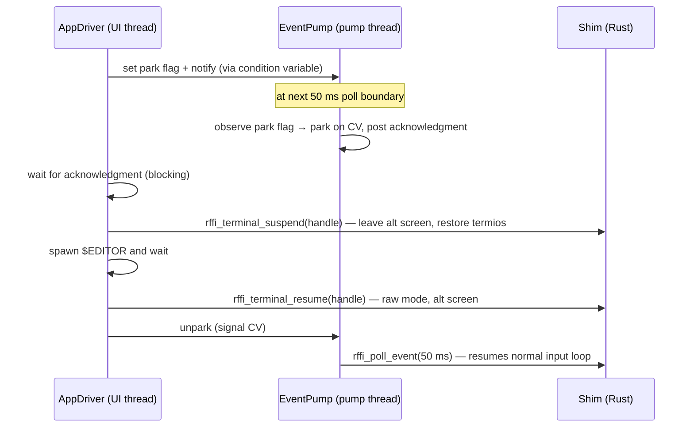

# FFI boundary — internals

This document covers the contract between the Swift layer (`RatatuiKit`) and the
Rust shim (`rust/ratatui-ffi`). Every claim is verified against the source files
cited inline.

Related references: `ARCHITECTURE.md §5.2, §5.4, §3f`; `rust/ratatui-ffi/README.md`.

---

## Threading contract

The shim surface is partitioned into exactly **two thread classes**. No entry
point belongs to more than one class. `RatatuiKit` asserts the calling thread
in debug builds (`precondition` in `Terminal.swift` and `Events.swift`); in
release builds the assertions compile away.

### Render/terminal class — UI thread only

All terminal lifecycle and drawing calls. These must be issued exclusively from
the thread that called `Terminal.init()` (the UI thread, i.e. the AppDriver's
thread).

| Entry point | Swift wrapper |
|---|---|
| `rffi_terminal_init` | `Terminal.init()` |
| `rffi_terminal_teardown` | `Terminal.teardown()` |
| `rffi_terminal_suspend` | `Terminal.suspend()` |
| `rffi_terminal_resume` | `Terminal.resume()` |
| `rffi_terminal_size` | `Terminal.size()` |
| `rffi_flush` | `Terminal.flush()` |
| `rffi_write_cells` | `CellBuffer` → `FFICellWriter.writeCells(...)` |
| `rffi_clear_rect` | `CellBuffer.clearRect(...)` |
| `rffi_clear_rect_widget` | widget draw calls |
| All widget entry points | `Widgets.swift` |
| All layout entry points | `Layout.swift` |

**Assertion mechanism** (`Sources/RatatuiKit/Terminal.swift`):

```swift
func assertRenderClass(owningThread: Thread) {
    #if DEBUG
        let current = Thread.current
        let isOwner = current === owningThread || current.isMainThread && owningThread.isMainThread
        precondition(isOwner, "[render/terminal-class] called from wrong thread ...")
    #endif
}
```

The owning thread is captured at `Terminal.init()` time. Test contexts that
designate a non-main thread as the UI thread compare by thread-object identity
rather than `isMainThread`.

### Input class — EventPump thread only

The single input-polling entry point.

| Entry point | Swift wrapper |
|---|---|
| `rffi_poll_event(timeout_ms)` | `pollEvent(timeout:pumpThread:)` in `Events.swift` |

EINTR is retried **inside the shim** — `RatatuiKit` callers never observe
EINTR as an error. `rffi_poll_event` returns `RFFI_TIMEOUT` (value `1`, a
positive sentinel distinct from all error codes) when the timeout elapses with
no event.

**Assertion mechanism** (`Sources/RatatuiKit/Terminal.swift`):

```swift
func assertInputClass(pumpThread: Thread) {
    #if DEBUG
        precondition(Thread.current === pumpThread,
            "[input-class] called from wrong thread — must be the EventPump thread")
    #endif
}
```

### Emergency restore — exempt from both classes

`rffi_emergency_restore()` (`Terminal.emergencyRestore()`) is explicitly exempt
from the thread-class contract. It is lock-free, allocation-free, and safe to
call from a signal handler. See the "Emergency restore design" section below.

---

## Error protocol

Every `rffi_*` entry point returns `i32`:

| Value | Meaning |
|---|---|
| `0` | Success |
| `1` (= `RFFI_TIMEOUT`) | Timeout with no event — only from `rffi_poll_event` |
| negative | Error code — see table below |

Error codes are defined in `rust/ratatui-ffi/src/error.rs`:

| Constant | Value | Meaning |
|---|---|---|
| `RFFI_ERR_NULL_PTR` | −1 | Null pointer passed to an entry point requiring a valid pointer |
| `RFFI_ERR_PANIC` | −2 | Rust panic caught by `ffi_guard!` |
| `RFFI_ERR_IO` | −3 | I/O error from crossterm or the OS |
| `RFFI_ERR_NOT_INIT` | −4 | Terminal not initialised (`rffi_terminal_init` must be called first) |
| `RFFI_ERR_OVERFLOW` | −5 | Internal size or bounds overflow |
| `RFFI_ERR_INVALID_ARG` | −6 | Invalid argument (misaligned pointer, zero capacity, invalid UTF-8, etc.) |

On a nonzero return the caller retrieves the human-readable description with:

```c
rffi_last_error(char *buf, size_t cap) -> i32
```

Returns the number of bytes written (excluding NUL), or −1 if `buf` is null
or `cap` is zero.

**Swift translation layer** (`Sources/RatatuiKit/FFIError.swift`):

`checkFFI(_ status: Int32)` throws `FFIError(code:message:)` whenever status
is nonzero. `FFIError.lastErrorMessage()` reads the last-error slot into a
512-byte buffer and decodes it as UTF-8.

---

## Last-error slot — process-global, not per-thread

The last-error string is stored in a single `Mutex<String>` behind a `OnceLock`
(`rust/ratatui-ffi/src/guard.rs`, line 61):

```rust
static LAST_ERROR: OnceLock<Mutex<String>> = OnceLock::new();
```

This is a deliberate design choice, not an oversight. Using a per-thread
`HashMap<ThreadId, String>` would pull in `std::hash::random::RandomState` (TLS)
and `thread::current()` (TLS). On macOS arm64e (Apple Silicon), thread-local
variables compiled by the Rust compiler (which targets `aarch64-apple-darwin`,
not `arm64e`) carry `tlv_bootstrap` function pointers that are not PAC-signed.
When a Swift test binary (compiled for arm64e) first accesses such a TLS
variable, arm64e's Pointer Authentication Code verification rejects the
unsigned pointer, causing a `SIGBUS`.

**Consequence for testing:** because the last-error slot is process-global,
all Rust tests must run single-threaded:

```sh
cargo test -- --test-threads=1
```

This is enforced by the Makefile and CI.

**Correctness for production:** the slot is only read immediately after an FFI
call returns nonzero, on the same thread that made the call. Since the UI thread
is the sole render/terminal-class caller and the pump thread is the sole
input-class caller, there is at most one active call at any moment — the global
slot is safe.

---

## Panic safety — `ffi_guard!` macro

Every `extern "C"` entry point wraps its body in `ffi_guard!` (defined in
`rust/ratatui-ffi/src/guard.rs`). The macro has two compile-time variants,
selected by the `swift_ffi` Cargo feature.

### Without `swift_ffi` (cargo test, dev builds)

`catch_unwind` converts Rust panics into an `RFFI_ERR_PANIC` return code, and
stores the panic message in the last-error slot. This keeps the test harness
alive when a deliberate-panic test fires.

```rust
ffi_guard!("rffi_foo", {
    // body — if this panics, ffi_guard catches it
    0
})
```

### With `swift_ffi` (static lib for Swift consumption)

`catch_unwind` is omitted entirely. The `swift_ffi` feature is set only during
the `cargo build --release --features swift_ffi` step in the Makefile. The
macro becomes a transparent call-through:

```rust
// swift_ffi: no catch_unwind — the body is called directly
$body
```

A Rust panic in the `swift_ffi` build **aborts the process**. This is
intentional: a panic in a terminal library is a bug, and aborting surfaces it
clearly. The elimination of `catch_unwind` also eliminates the reference to
`std::panicking::panic_count::LOCAL_PANIC_COUNT`, a thread-local that would
trigger the arm64e SIGBUS described above.

**Constructor functions** (those returning `*mut T` rather than `i32`) use the
companion `ffi_guard_ptr!` macro, which returns a null pointer on panic rather
than an error code.

---

## Two API groups and debug assertions

The two thread classes map directly to the two API groups `ARCHITECTURE.md §2`
identifies on the component-map diagram edges:

```
REN -- "render-class (UI thread)" --> RK
PUMP -- "input-class (pump thread)" --> RK
```

`RatatuiKit` asserts the correct thread at the Swift call site — never inside
the Rust shim. This keeps the Rust side thread-agnostic and places the
invariant enforcement where Swift's type system and debugging tools are most
effective.

The two assertion helpers (`assertRenderClass` and `assertInputClass`) are
package-internal (`Sources/RatatuiKit/Terminal.swift`) so that `Events.swift`
can reuse `assertInputClass` for the `pollEvent` call without exposing the
helpers to `MoonSwiftTUI`.

---

## Cell drawing — batching contract

The FFI batching rule is enforced by `CellBuffer`
(`Sources/RatatuiKit/CellBuffer.swift`):

- The renderer calls `CellBuffer.write(col:row:char:style:)` per cell.
- `CellBuffer` accumulates contiguous same-style cells into `CellRun` values.
- A new run begins when the style changes, the column is not exactly
  `lastCol + 1`, or the row changes.
- `CellBuffer.flush(to:)` issues one `rffi_write_cells` call per accumulated
  run.

At 200 × 60 (12 000 cells) the ceiling is approximately 1 500 FFI calls (60
rows × ≤ 25 style runs worst case). A per-cell design would produce 12 000
calls per frame and is forbidden (ARCHITECTURE.md §3b).

The `CellWriter` protocol (`CellBuffer.swift`) is the testability seam:
production code uses `FFICellWriter` (which calls the real shim); tests inject
`MockCellWriter` (which records calls) or `CellGrid` (which writes into an
in-memory 2-D cell surface for snapshot assertions).

---

## Emergency restore design

`rffi_emergency_restore()` is the crash-path terminal restore primitive,
callable from signal handlers (ARCHITECTURE.md §3f).

**What it does:**

1. Reads `INITIALIZED` with an atomic `Acquire` load. Returns immediately if
   false (guarded no-op — safe to install before terminal init, §3a).
2. Reads `TTY_FD` with an atomic `Acquire` load.
3. Issues a raw `write(2)` of `ESC[?1049l ESC[?25h ESC[0m` to the tty fd
   (leave alternate screen, show cursor, reset attributes).
4. Performs a best-effort `tcsetattr(TCSANOW, saved_termios)`.

**Why it is exempt from the error protocol:**

The function returns nothing, stores nothing, takes no locks, and performs no
allocation. It uses only `write(2)` (async-signal-safe per POSIX) and
`tcsetattr` (technically not signal-safe, but the worst-case outcome is a
silent no-op — the user runs `reset`).

**Initialization sequence** (`rust/ratatui-ffi/src/terminal.rs`):

`rffi_terminal_init` calls `save_termios_and_fd()` **before** setting
`INITIALIZED`. The order matters: the static storage is populated before the
flag that arms `rffi_emergency_restore` is set.

```
Mermaid diagram — signal-safe restore sequence

sequenceDiagram
    participant H as Signal handler (Main)
    participant S as rffi_emergency_restore

    H->>S: call (from SIGSEGV/SIGBUS/SIGILL/… handler)
    S->>S: atomic read INITIALIZED — false → return (no-op)
    Note over S: if INITIALIZED is true:
    S->>S: atomic read TTY_FD
    S->>S: write(2) ESC[?1049l ESC[?25h ESC[0m to tty fd
    S->>S: tcsetattr(TCSANOW, &SAVED_TERMIOS) — best-effort
    S-->>H: returns (void)
    H->>H: sigaction(SIG_DFL), raise(signal) — real exit status
```

The statics used by `rffi_emergency_restore` are:

| Static | Type | Set by |
|---|---|---|
| `INITIALIZED` | `AtomicBool` | `rffi_terminal_init`, after statics populated |
| `TTY_FD` | `AtomicI32` | `save_termios_and_fd()` (called first in init) |
| `SAVED_TERMIOS` | `OnceLock<libc::termios>` | `save_termios_and_fd()` |

Swift surface: `Terminal.emergencyRestore()` is a `static func` exempt from
thread-class assertions and the `Terminal` instance — it calls
`rffi_emergency_restore()` directly.

---

## $EDITOR suspend/resume handshake

The pump-park protocol (ARCHITECTURE.md §5.2) ensures no input-class call is
in flight while the terminal is suspended:



`rffi_terminal_suspend` leaves `INITIALIZED` set. This ensures
`rffi_emergency_restore` still works if the process crashes while the editor is
open.

---

## Source files

| File | Role |
|---|---|
| `rust/ratatui-ffi/src/guard.rs` | `ffi_guard!`/`ffi_guard_ptr!` macros, `LAST_ERROR` global, `rffi_last_error` |
| `rust/ratatui-ffi/src/error.rs` | `RFFI_*` error-code constants |
| `rust/ratatui-ffi/src/terminal.rs` | Lifecycle entry points, `rffi_emergency_restore`, lock-free statics |
| `rust/ratatui-ffi/src/events.rs` | `rffi_poll_event`, `RffiEvent` struct (key/resize/mouse/paste) |
| `rust/ratatui-ffi/src/cells.rs` | `rffi_write_cells`, `rffi_clear_rect`, `rffi_flush` |
| `Sources/RatatuiKit/Terminal.swift` | `Terminal` class, `assertRenderClass`, `assertInputClass` |
| `Sources/RatatuiKit/FFIError.swift` | `FFIError`, `checkFFI`, `lastErrorMessage` |
| `Sources/RatatuiKit/Events.swift` | `pollEvent(timeout:pumpThread:)`, `Event` decoding |
| `Sources/RatatuiKit/CellBuffer.swift` | `CellBuffer`, `CellWriter`, `FFICellWriter`, `CellGrid` |
